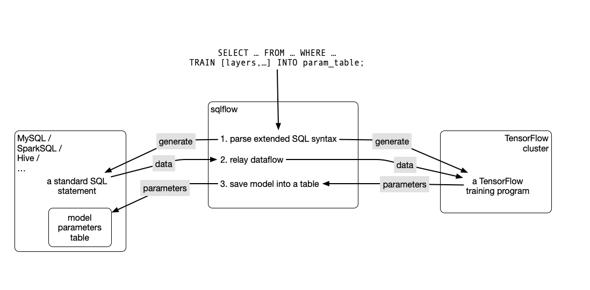
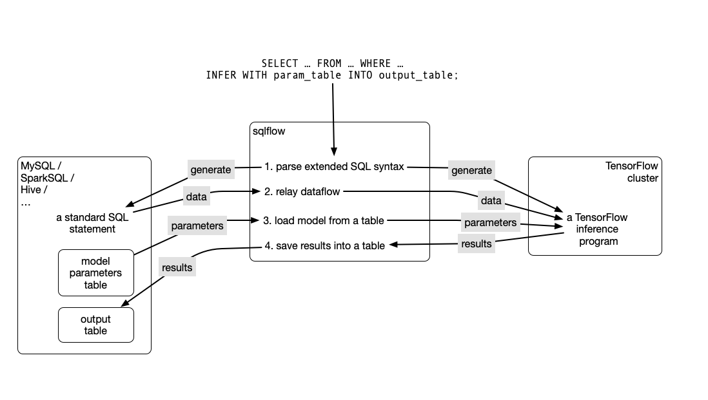

# SQLFlow

## What is SQLFlow

SQLFlow is a small program that connects a SQL engine, e.g., MySQL, Hive, SparkSQL, to a TensorFlow engine.  SQLFlow provides an extended SQL syntax, which can train a model from the result data from a SELECT statement, and does inference with the data.

## An Overview

The extended SQL language supports a `TRAIN` clause for the `SELECT` statement.  The clause specifies a feature mapping and a model structure.  The feature mapping is for converting fields of the `SELECT` result into features.  The model structure should take the features as its input.  The training result is the model parameters, which would be saved into a table.

The extended SQL language also supports an `INFER` clause which loads the model parameters and does inference with the `SELECT` results.

