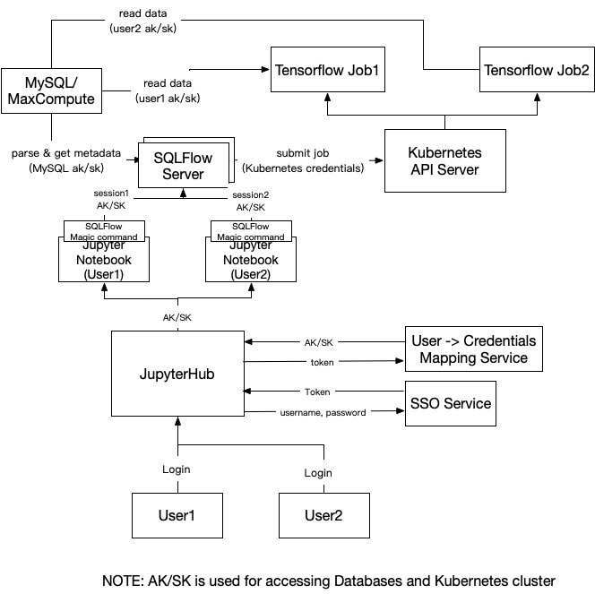

# Design: SQLFlow Authentication and Authorization

## Terminology and Background

For a quick explanation, the word "Authentication" means to identify the
user recognized by the system is the actual real-world user. And "Authorization"
means to grant privileges to the user to access some part of the system
functionalities.

SQLFlow works as a "bridge" between databases and
Deep Learning/Machine Learning frameworks. In order to execute a job,
SQLFlow need both permissions to access databases and submit jobs to
systems to run distributed training jobs, like submitting jobs to Kubernetes
to run a distributed Tensorflow job.

In production environments, one SQLFlow server is designed to accept many clients'
connections and job submissions. In this case, we must securely store a mapping
from the user's ID to the user's credentials for accessing both the database and the
training cluster. Then server-side "session" should also be considered during
implementing authentication.

For authorization, it will be definitely reasonable to directly proxy requests to
databases and training clusters, the request will be denied if the current user
have no access to the requested service.

## Design

The [JupyterHub](https://jupyterhub.readthedocs.io/en/stable/) is the central web
page for users to work on. JupyterHub can support many well-known authorization
and authentication [methods](https://github.com/jupyterhub/jupyterhub/wiki/Authenticators)
so that it will be easy to adapt the full solution to cloud environments
or on-premise.

### Session

A server-side "session" is needed to store credentials for each client to access
the database and submitting jobs. The session can be defined as:

```go
type Session struct {
    Token          int64   // User token granted after login
    ClientEndpoint string  // ip:port from the client
    DBConnStr      string  // mysql://AK:SK@127.0.0.1:3306
    // cached connection to database for current session, can point to a global connecion map
    DBConn         *sql.DB
    K8SAK          string  // AK or username for accessing kubernetes
    K8SSK          string  // SK or secret for accessing kubernetes
}
```

**Note:** that SQLFlow should be dealing with three kinds of services:

- SQLFlow RPC service itself
- Database service that stores the training data, e.g. MaxCompute
- A training cluster that runs the SQLFlow training job, e.g. Kubernetes

The token will act as the unique id of the session. The session object
should be expired within some time and deleted on the server memory.

The Database connection string also contains credential information
follow the format like `mysql://AK:SK@127.0.0.1:3306`.

To submit to clusters like Kubrenetes, we also need to store credentials
to access Kubernetes API server, so `K8SAK, K8SSK` is also stored in
the session.

We want to make sure that SQLFlow servers are stateless so that we can
deploy it on any cluster that does auto fail-over and auto-scaling. In
that case, we store session data into a reliable storage service like
[etcd](https://github.com/etcd-io/etcd). 

### Authentication of SQLFlow Server

The below figure demonstrates overall workflow for authorization and
authentication.



Users can access the JupyterHub web page using their own username and password.
The user's identity will be verified by the [SSO](https://en.wikipedia.org/wiki/Single_sign-on)
service or **any** other authentication methods. Then the JupyterHub
is responsible to fetch current user's "AK/SK"s (typically securely encoded strings)
for accessing databases and the Kubernetes cluster. "AK/SK" for accessing database and
the Kubernetes cluster may not be the same. The mapping from the user's ID to the user's
"AK/SK" is stored in the "Mapping Service", which is an HTTPS RESTful service.

Then JupyterHub will spawn the Jupyter
Notebook instances for each user and set the user's login token and "AK/SK" for
the Notebook instance to some secure storage so that the SQLFlow magic command plugin
can read it.

Then we create a session on the SQLFlow server for the current user by calling below RPC:

```proto
service SQLFlow {
    rpc CreateSession (Session) returns (Response);
}

message Session {
    string token = 1;
    string client_endpoint = 2;
    string db_conn_str = 3;
    string k8s_ak = 4;
    string k8s_sk = 5;
}
```

After that, the login procedure is finished. Then any SQL statement typed in
the current user's Notebook instance, it will be translated to jobs using
the current users' AK/SK and submit to the user's namespace on Kubernetes.

If one user is already logged in, and the Jupyter Notebook instance is still
alive, he or she can directly use the Notebook to run any job.

If the Notebook instance crashed, the JupyterHub should be able to re-create
the instance and set the user's token and "AK/SK".

If one user's session is expired, the JupyterHub should be able to refresh the
login and fetch the "AK/SK" again, then re-create the Notebook instance.


## Conclusion

To make SQLFlow server production ready, supporting serving multiple clients on one
SQLFlow server instance is necessary, Authentication and session management should
be implemented.

For different environments like on cloud or on-premise, we may need to implement
different "authenticators" for JupyterHub to adapt them.
