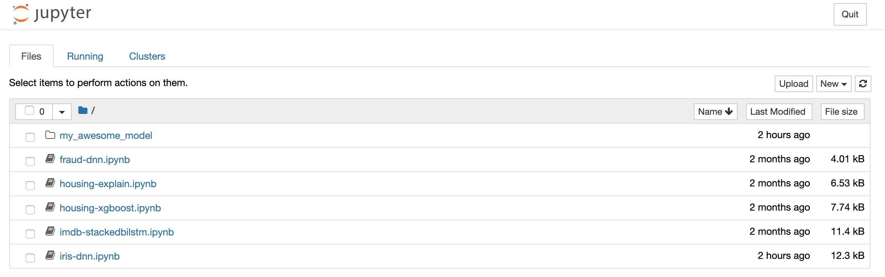
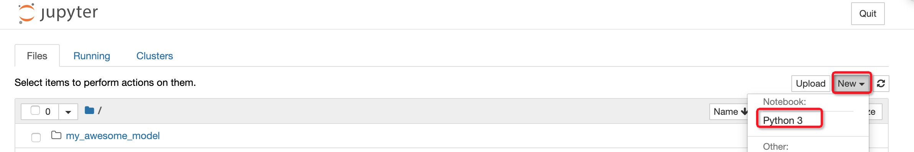

# Steps to Contribute a Model to SQLFlow

SQLFlow extends SQL syntax to do AI.  The syntax extension allow SQL statements referring to model definitions defined as Python functions and classes, for example, https://github.com/sql-machine-learning/models/blob/develop/sqlflow_models/dnnregressor.py.

If you are a machine learning specialist and you would like to create a model for data analysts, this document is for you.  We have several steps for you to follow to release your model definition, so analyst users can train a model using your model definition and their data:

1. Define models as Python source code.
1. Start a Docker container as the develop environment.
1. Debug in the Jupyter Notebook.
1. Publish your model.


## Define Models as Python Source Code

### Prepare the Director

To create your custom models, please put all Python files in a directory. SQLFlow requires custom models released in the form of Docker images, so we need a Dockerfile at the root of the directory. Also, to refer to a model definition with the name in the format of `docker_image:docker_image_tag/class_or_module_name`, we need to expose the class name or the module name in the `__init__.py` file at the root directory, so you may follow below steps to create this folder:

- Create a a folder to put all your sub-folders and files, e.g.  `my_model_collection/`.
- Write the model code at anywhere under this folder, you may also create any sub-folders like `layers/` or `utils/` to put your library code.
- Add the `Dockerfile` for building and releasing your model definition.
- Add an `__init__.py` file to export model classes so that SQLFlow can recognize.

```
- my_model_collection/
---- __init__.py
---- some_model_definitions.py
---- some_other_model_definitions.py
---- tests.py
---- layers/
---- utils/
- Dockerfile
```

###  Define a Model with Keras

In `some_model_definitions.py` you should develop the model's Python code, typically a [Keras subclass model](https://www.tensorflow.org/guide/keras/custom_layers_and_models#the_model_class) like below:

```python
import tensorflow as tf
class MyAwesomeClassifier(tf.keras.Model):
    def __init__(self, feature_columns=None, hidden_units=[100,100]):
        """MyAwesomeClassifier
        :param feature_columns: feature columns.
        :type feature_columns: list[tf.feature_column].
        """
        super(MyAwesomeClassifier, self).__init__()
        self.feature_layer = None
        if feature_columns is not None:
            self.feature_layer = tf.keras.layers.DenseFeatures(feature_columns)
        self.hidden_layers = []
        for hidden_unit in hidden_units:
            self.hidden_layers.append(tf.keras.layers.Dense(hidden_unit, activation='relu'))
        self.prediction_layer = tf.keras.layers.Dense(1, activation='sigmoid')

    def call(self, inputs, training=True):
        if self.feature_layer is not None:
            x = self.feature_layer(inputs)
        else:
            x = tf.keras.layers.Flatten()(inputs)
        for hidden_layer in self.hidden_layers:
            x = hidden_layer(x)
        return self.prediction_layer(x)

def optimizer(learning_rate=0.001):
    return tf.keras.optimizers.Adagrad(lr=learning_rate)

def loss(labels, output):
    return tf.reduce_mean(tf.keras.losses.binary_crossentropy(labels, output))

def prepare_prediction_column(prediction):
    return prediction.argmax(axis=-1)
```

Note that we defined a class named `MyAwesomeClassifier` which will be used as the model definition.  You can define whatever arguments in the `__init__` function of this class, these arguments can be used when you write the training SQL statement by adding `WITH argument=value, argument=value ...`.  You also need to define three functions:

- `optimizer`: defines the default optimizer used when training.
- `loss`: define the default loss function used when training.
- `prepare_prediction_column`: define how to process the prediction output.

### Write Models Other Than Keras

If you need to control the details of the training process or define custom models rather than a Keras model, you can define a function `sqlflow_train_loop` to implement custom model training processes. Note that the model class still need to extend `tf.keras.Model` so that SQLFlow can recognize it's a custom model and execute the function `sqlflow_train_loop` when training. Please refer to our [Deep Embedding Clustering Model](https://github.com/sql-machine-learning/models/blob/develop/sqlflow_models/deep_embedding_cluster.py) as an example.

```python
class MyAwesomeClassifier(tf.keras.Model):
    def __init__(self, feature_columns=None):
        ...
    def sqlflow_train_loop(self, dataset, epochs=1, verbose=0):
        # do custom training here, parameter "dataset" is a tf.dataset type representing the input data.
```

### Export Model Definition

In `__init__.py` you should expose your model classes by adding lines like:

```python
from some_model_definitions import MyAwesomeClassifier
```

### Write the Dockerfile

To build a Docker image, we need a file named `Dockerfile` like below. Please be aware that the base image must be `sqlflow/sqlflow`, which contains the SQLFlow server and other necessary dependencies.

```dockerfile
FROM sqlflow/sqlflow
RUN pip install scikit-learn six
# copy model definition code to /sqlflow_models
ADD my_model_collection /sqlflow_models
# add PYTHONPATH environment variable to /sqlflow_models
ENV PYTHONPATH /sqlflow_models
```

### Versioning

To keep track of your edit to files in this directory, you can make it a Git repository.  You can even share your repository through GitHub.  For more about Git and GitHub, please refer to related documents.  We plan to provide a command-line tool `sqlflow` to simplify the engineering process for researchers who are not familiar with Git, GitHub, or Docker.

Here are some quick steps for researchers who would like to contribute to SQLFlow's official model repo.

1. You can contribute to SQLFlow's [model zoo repo](https://github.com/sql-machine-learning/models) by:
    1. Fork SQLFlow's model zoo repo: click "Fork" button on the right corner on page https://github.com/sql-machine-learning/models .
    1. Clone your forked repo by `git clone [your forked repo url]`, you can find the forked repo URL by clicking the green button "Clone or download".
    1. Move to the cloned directory: `cd models`.
1. Or you can create a new git repository to store your model code:
    1. Create a new repository on [github](https://github.com) or any other git systems.
    1. Move to the directory of the repository: `cd my_models` (assume you created a repo named "my_models").
    1. Create a directory under `my_models` to store Python package: `mkdir my_model_collection`.
    
## Start a Docker Container as the Develop Environment

```bash
docker run -p 8888:8888 -v $PWD/my_model_collection:/workspace/my_model_collection  sqlflow/sqlflow bash -c 'export PYTHONPATH=/workspace:$PYTHONPATH; bash /start.sh'
```

Note that we mount our model development directory `my_model_collection/` into the container and set the environment variable `PYTHONPATH`, so that we can directly test out the model inside this container.  Change the directory to `sqlflow_models` if you are contributing models to https://github.com/sql-machine-learning/models.

Open the browser and go to http://localhost:8888, it's a Jupyter notebook environment, you can see your model development directory `my_model_collection` together with SQLFlow's basic tutorials.



## Testing and Debugging

Go back to http://localhost:8888, add an `ipynb` file to test the model by clicking the button "New" -> "Python 3"



Write an SQLFlow statement to test the model using iris dataset (you need to import the dataset to MySQL if you want to test the model using other datasets.), assume you have developed a model class name:

```sql
%%sqlflow
SELECT * FROM iris.train
TO TRAIN MyAwesomeClassifier
WITH model.n_classes=3
LABEL class
INTO models_db.awesome_model;
```

you may go back to `some_model_definitions.py` and modify the model code until it works as you expected.

## Publish Your Model

In the final step, you need to publish your model so that other SQLFlow users can get the model and use it.

1. If you are contributing to https://github.com/sql-machine-learning/models, file a pull request on Github to merge your code to SQLFlow's models repo.  The model should be available when SQLFlow's Docker image `sqlflow/sqlflow` is updated.
1. If you are creating your own repo, you need to write a `Dockerfile` to build your model into a Docker image:
    1. Write a `Dockerfile` like below:
    ```docker
    FROM sqlflow/sqlflow
    ADD my_model_collection/ /models/
    ```
    1. Then build and push the Docker image by:
    ```
    docker build -t your-registry.com/your_group/model_image:v0.1 .
    docker push your-registry.com/your_group/model_image:v0.1
    ```
1. Then test run the model image in SQLFlow by adding the Docker image name before the model name:

    **NOTE: You should use the model image on production environments (deploy SQLFlow with workflow mode), if you need to test the model image locally please follow [this](./argo-setup.md) guide to setup local workflow mode with minikube.**

    ```sql
    SELECT * FROM iris.train
    TO TRAIN your-registry.com/your_group/model_image:v0.1/MyAwesomeClassifier
    WITH model.n_classes=3
    LABEL class
    INTO models_db.awesome_model;
    ```
