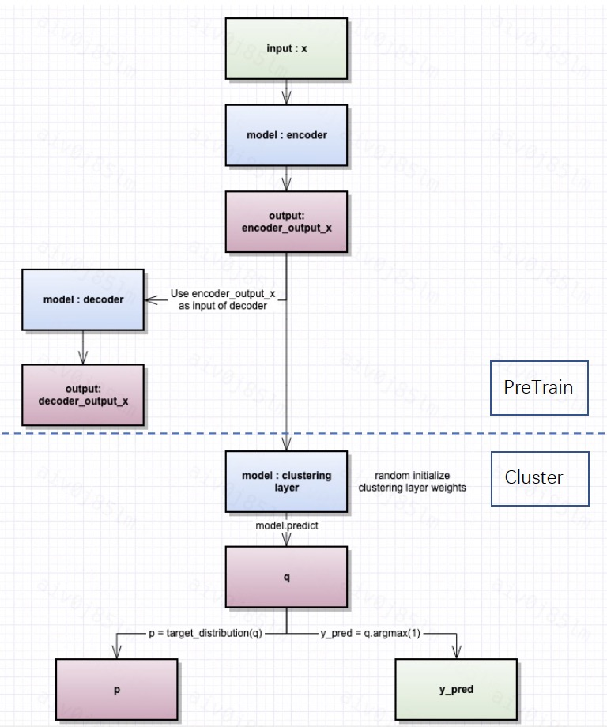

# Clustering in SQLFlow to Analyze Patterns in Data

## ClusterModel Introduction

Most of time when businessman and analyst faced the data, they need not only the supervised learning model to perform classification and prediction, but also unsupervised learning to catch hidden patterns. This can help analysts to draw inferences from datasets consisting of input data without labeled responses, such as grouping users by their behavioral characteristics. 


This design document introduced how to support the `Cluster Model` in SQLFlow.

The figure below demonstrates the overall workflow for cluster model training, which include both the pre_train autoencoder model and the clustering model.(Reference https://www.dlology.com/blog/how-to-do-unsupervised-clustering-with-keras/)



1. The first part is used to load a pre_trained model. We use the output of the trained encoder layer as the input to the clustering model. 
2. Then, the clustering model starts training with randomly initialized weights, and generate clusters after multiple iterations.
3. The overall train process ultimately outputs an unsupervised clustering model.


## How to Implement a ClusterModel in SQLFlow

### User Interface in SQLFlow 

In this scenario, we focus on the extraction of data patterns in unsupervised learning. 

So, the user can use `TO TRAIN` keyword to training a model. The user can also specify the training hyper-parameters with the keyword `WITH` and determine whether to use pre-trained model by `USING`. The training and predicting syntax looks like:

TO TRAIN SQL:

``` sql
SELECT * FROM input_table
TO TRAIN clusterModel
WITH
    model.encode_units = [100, 7]
    model.n_clusters = 5
    model.run_pretrain = false
COLUMN m1, m2, m3, m4, m5, m6, m7, m8, m9, m10 
USING existed_pretrain_model
INTO my_cluster_model;
```

TO PREDICT SQL:

``` sql
SELECT *
FROM input_table
TO PREDICT output_table.group_id
USING my_cluster_model;
```

where:
- `input_table` is the high-dimensional table to be clustered.
- `model.encode_units` is the autoencoder model layer's encoder units, the decode_units can reverse encode_units directly.
- `model.n_clusters` is the number of patterns after clustering.
- `my_cluster_model` is the trained cluster model.
- `run_pretrain`  is used to determine if autoencoder pre_train needs to be run, default true.
- `existed_pretrain_model` is used to specify an existing pretrain_model
- `output_table` is the clustering result for input_table, which is adding the `group_id` column predicted by the cluster model to the input_table. The `group_id` is the category label predicted by the cluster model.

### Code Details

- sqlflow_models/clusterModel.py

```python
class  clusterModel(tf.keras.Model):
    def pre_train(dataset):
        ...
        self.autoencoder.fit(dataset)
        pretrainmodel.save("/tmp/ae_pretrain.h5"）
    def target_distribution():
        ...
    def  sqlflow_train_loop():
        for ite in range(int(maxiter)):
            if ite % update_interval == 0:
                q = model.predict(x, verbose=0)
                p = target_distribution(q)  # update the auxiliary target distribution p
                y_pred = q.argmax(1)
            idx = index_array[index * batch_size: min((index+1) * batch_size, x.shape[0])]
            loss = model.train_on_batch(x=x[idx], y=p[idx])
            index = index + 1 if (index + 1) * batch_size <= x.shape[0] else 0
```

- template_tf.go
```python
if hasattr(classifier, 'pre_train'):
    classifier.pre_train(...)
if hasattr(classifier, 'sqlflow_train_loop'):
    classifier.sqlflow_train_loop(...)
```

## Note

- The user can choose whether to run pre_train before the cluster model, ie run_pretrain=true. And the user can also choose to load the already trained model by loading the existed_pretrain_model.

Therefore, there are four cases in total:

1.  model.run_pretrain = true & User do not use `USING` keyword in this situation.

    Autoencoder Pre_train + Random initialization weights for cluster. (Note that model.encode_units "does work" at this time.)

2.  model.run_pretrain = true & Using existed_pretrain_model.
    existed_pretrain_model Pre_train + Random initialization weights for cluster. (Note that model.encode_units "does not work" at this time.)
    
3.  model.run_pretrain = false & User do not use `USING` keyword in this situation.
    Random initialization weights for cluster. (Note that model.encode_units "does not work" at this time.)
    
4.  model.run_pretrain = false & Using existed_pretrain_model.
    existed_pretrain_model Pre_train + Random initialization weights for cluster. (Note that model.encode_units "does not work" at this time.)

- In the first stage of the clustering model on SQLFlow, we plan to achieve the `first case`. We will achieve the other cases in the later. 

- Users can use the trained cluster model in ` TO PREDICT SQL` to predict the group of input_table to get output_table.

- Finally, the user can perform a combined aggregation operation on the output_table based on the SQL statement to obtain a result_table, which can be saved to the local dataframe and then analyzed according to his own needs.

Sometimes, analysts will compare the mean of each feature in each group of users, this helps them to understand the difference of behavioral characteristics in each group.

```mysql
%%sqlflow
select 
    group_id
    , avg(m1) as avgm1
    , avg(m2) as avgm2
    , avg(m3) as avgm3
    , avg(m4) as avgm4
    , avg(m5) as avgm5
    , avg(m6) as avgm6
    , avg(m7) as avgm7
    , avg(m8) as avgm8
    , avg(m9) as avgm9
    , avg(m10) as avgm10
from output_table
group by group_id
```

```python
    _.to_dataframes(result_table) 
```

- The example of result_table:

|group_id |  m1  | m2   | m3   | m4   | m5   | m6   | m7   | m8   | m9   | m10  | 
|---------|------|------|------|------|------|------|------|------|------|------|
|    0    | 0.017| 0.015| 0.013| 0.012| 0.01 | 0.01 | 0.009| 0.008| 0.008| 0.008|
|    1    | 0.195| 0.173| 0.154| 0.138| 0.124| 0.111| 0.1  | 0.091| 0.083| 0.076|
|    2    | 0.014| 0.012| 0.011| 0.01 | 0.009| 0.008| 0.007| 0.005| 0.005| 0.004|
|    3    | 0.005| 0.003| 0.003| 0.002| 0.001| 0.001| 0.001| 0.0  | 0.0  | 0.0  |
|    4    | 0.311| 0.291| 0.274| 0.257| 0.24 | 0.224| 0.209| 0.196| 0.185| 0.175|

