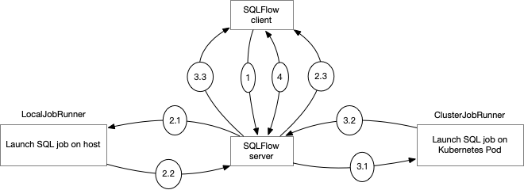

# High-available SQLFlow server

## Motivations

In the current system, SQLFlow client connects the SQLFlow server with a long live connection. the SQLFlow client sends
a gRPC request which contains a SQL statement and blocking until the SQLFlow server finishes executing the SQL statement.

For each SQL statement, the SQLFlow code generator would generate a submitter program in Python, and then the SQLFlow server
would launch a process on the host or launch a distributed job on a cluster(Kubernetes/Yarn), this would cause two problems in the production environment:

1. The local job may cause the SQLFlow server resource insufficient when there are too many SQL jobs.
1. Sometimes, the SQL job takes too much time, and the gRPC calls timeout.
1. If an SQLFlow server instance fails, the SQL jobs in this instance failed.

In this design, we propose to:

1. communicate with the SQLFlow server in a pooling manner.
1. implement `ClusterJobRunner` on the server-side to launch the SQL Job on Kubernetes.

We recommend using `ClusterJobRunner` in the production environment.

## High-Level Design

The high-availabe SQLFlow job workflow is as follows:



1. SQLFlow client sends the SQL statement via a gRPC call to the SQLFlow server.
1. For the `LocalJobRunner`:
    1. SQLFLow server launches a SQL job on the host and generates a token mapping to the SQL job.
    1. SQLFLow server maintains a mapping from token to the SQL job.
    1. SQLFlow server returns the token to the client.
1. For the `ClusterJobRunner`:
    1. SQLFlow server launches a Kubernetes Pod via Kubernetes API and executes the SQL job in it.
    1. SQLFlow server fetches the Pod ID.
    1. SQLFlow server returns the Pod ID as the token to the client.
1. The SQLFlow client fetches the job result and job status in a polling manner until the returned job status is **SUCCESS** or **FAILED**.

## Proposal Details

### SQLFLow Client

The client calls `Run` and receives a string token. The client subsequently fetches the result using the token periodically. And the client is unaware of the deployment type of the server.

```python
token = client.Run("sqls ...")
while True:
    result = client.Fetch(token)
    for r in result.results:
        # do stuff: either print logs or construct Rows
    if result.job_status in (SUCCEEDED, FAILED):
        break
    sleep(some_time)
```

And the Protocol Buffer definition looks like the following.

```proto
service SQLFlow {
    // Client calls Run and receives a string token.
    rpc Run (Request) returns (Token);
    // Client subsequently fetches the result using the token periodically.
    rpc Fetch(Token) returns (Result);
}

message Token {
    string token = 1;
}

message Session {
    string token = 1;
    string db_conn_str = 2;
    bool exit_on_submit = 3;
    string user_id = 4;
}

message Result {
    JobStatus job_status = 1;
    // Fetches multiple responses at once
    repeated Response results = 2;
}

message JobStatus {
    enum Code {
        PENDING = 0;
        RUNNING = 1;
        SUCCEEDED = 2;
        FAILED = 3;
        UNKNOWN = 4;
    }
    string message = 0;
}
```

### JobRunner Interface

The `JobRunner` interface should provide two functions `run` and `fetch`:

```go
type JobRunner interface {
  run(sql string, pr *PipeReader) (token string, err error)
  fetchResult() (result *pb.Result)
}

func (s *Server) Run(ctx context.Context, req *pb.Request) (*pb.Token, error) {
  db := s.db
  pr, pw := sf.Pipe()
  token := s.jobRunner.run(req.Sql, pr, pw)
  return &pb.Token(Token: token), nil
}

func (s *Server) Fetch(ctx context.Context, token *pb.Token) (*pb.Result, error) {
  result, error := s.jobRunner.fetch(token.Token)
  return result, nil
}

```

### Local Job Runner 

Upon processing a `Run` request, the server generates, bookkeeps, and returns the token to the client. Upon processing a `Fetch` request, the server looks up the result channel and returns the most recent result.

```go
type LocalJobRunner {
  jobs map[string]*PipeReader
}

func (r LocalJobRunner)run(pr *PipeReader, pw *PipeWriter){
  token := tokenGen()
  r.jobs[token] = pr
  go func() {
      defer pw.Close()
      pw.Write(`RUNNING`)
      sqlStatements, _ := sf.SplitMultipleSQL(req.Sql)
      for _, singleSQL := range sqlStatements {
         for e := range s.run(singleSQL, db, s.modelDir, req.Session).ReadAll() {
            pw.Write(e)
         }
      }
      pw.Write(`SUCCEEDED`)
  }()
  return token
}

func (r LocalJobRunner) fetch(token string) (pb.Result, error) (
  result := &pb.Result{}
  pr, ok := r.jobs[token]
  if !ok {
      return nil, fmt.Errorf("unrecognized token %s", token.Token)
   }
   for ;; {
      select {
      case res := <-pr.ReadAll():
         // construct result
      case <-time.After(1 * time.Second):
         break;
      }
   }
   return result, nil
)

```

Since we have multiple gRPC calls for a server instance, we need to maintain a state across different calls.
So we use a map `map[string]*PipeReader` to maintain the job states on the server

### Cluster Job Runner on Server

Upon processing a `Run` request, the server launches a Kubernetes Pod and return the Pod ID and log view URL to the client.
Upon processing a `Fetch` request, the server checks the Pod status and returns the `JobStatus`.

```go
type ClusterJobRunner {
  jobs map[string]*PipeReader
}

func (r LocalJobRunner)run(sql string, pr *PipeReader, pw *PipeWriter) (string, error){
  podID, err := r.launchK8sPod(sql)
  pw.Write(fmt.Sprintf("Logs viewer URL: %s", r.logsViewerURL(podID)))
  return podID, nil
}

func (r LocalJobRunner) fetch(token string) (pb.Result, error) (
  result := &pb.Result{}
  result.job_status := r.PodStatus(token)
  return result, nil
)
```

### Store the Trained Model

For example, a tinny `TRAIN` statement:

``` sql
SELECT ...
TRAIN DNNClassifer
WITH
  ...
COLUMN ...
INTO sqlflow_model
```

The SQL would save the model named `sqlflow_model` which contains two parts:

1. `TRAIN` statement, which would be saved as a `.mod` file.
1. Model weights, which would be saved as a `.tar.gz` file.

an example of a trained model folder is as follows:

``` text
`-sqlflow_model
  |-sqlflow.gob
  `-sqlflow_model.tar.gz
```

There are two steps to save the trained model:

1. SQLFLow server creates a folder `sqlflow_model` on the distributed file system and saves `sqlflow.gob` in it.
1. The machine learning framework saves the model weights file `sqlflow_model.tar` in the same folder.

### Dealing with failures

Q: What if the client forgets to fetch? For example, a user hits `ctrl+C` in the Jupyter Notebook right after the `client.Run`.

A: The client can specify a timeout T. The server will kill the corresponding job if the client doesn't fetch in the last T seconds.
