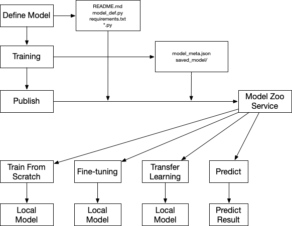

# Model Zoo

SQLFlow model zoo is a place to store model definitions, pre-trained model weights and model documentations. You can directly train, predict, analyze using one of the models using SQLFlow, or you can do model fine-tune, transfer learning to use the model to fit your dataset.

SQLFlow should support below features to support common cases in machine learning:

1. Host model definition and pre-trained weights in `sqlflow.org`. e.g. `sqlflow.org/modelzoo/iris_dnn_128x32` points to a directory containing a model definition of `DNNClassifier` with 128, 32 hidden layers and pre-trained weights using the iris dataset.
1. Download pre-trained model to predict a dataset:
   ```sql
   SELECT * FROM iris.predict_samples
   PREDICT predict_result.class
   USING sqlflow.org/modelzoo/iris_dnn_128x32;
   ```
1. Train a model from scratch using the model definition:
   ```sql
   SELECT * FROM iris.new_iris_train
   TRAIN sqlflow.org/modelzoo/iris_dnn_128x32
   INTO modeldb.my_iris_dnn_model;
   ```
1. Transfer learning to fit a new dataset with the same features:
   ```sql
   SELECT * FROM iris.transfer_iris_samples
   TRAIN sqlflow.org/modelzoo/iris_dnn_128x32
   USING sqlflow.org/modelzoo/iris_dnn_128x32
   INTO modeldb.my_iris_dnn_model;
   ```
1. Fine-tune the pre-trained model:
   ```sql
   SELECT * FROM iris.train
   TRAIN sqlflow.org/modelzoo/iris_dnn_128x32
   WITH model.learning_rate=0.001, model.learning_rate_decay="cosine_decay" ...
   INTO modeldb.my_iris_dnn_model_fine_tune;
   ```

## The Model Zoo Hosting Service

The model zoo hosting service is a file service that can be accessed from the internet.
It serves all available models and corresponding pre-trained weight. We may need to use
a [CDN](https://en.wikipedia.org/wiki/Content_delivery_network) service if the traffic
becomes large.

Each model is saved on the server under a unique directory like: `sqlflow.org/modelzoo/iris_dnn_128x32`.
The directory name is responsible to explain the model's type, network structure and which dataset is
used to train the pre-trained weights. You can access `sqlflow.org/modelzoo/iris_dnn_128x32/README.md`
from the browser to get the model's full documentation. All models under `sqlflow.org/modelzoo` are
developed under `https://github.com/sql-machine-learning/models` weights is only stored under
`sqlflow.org` but not under Github.

The content of the directory should be like:

```
iris_dnn_128x32
   - model_meta.json  # model information useful for load and run.
   - README.md        # model documents.
   - requirments.txt  # python package dependency for the model.
   - model_def.py     # python file of model definition (TensorFlow Estimator model or Keras model).
   - model/           # the saved TensorFlow/Keras/XGBoost model.
   - some_deps.py     # if model_def.py have dependent python source files just put them in the same folder.
```

Some details about the files in one model:

- `model_meta.json` contains important information used for load and run this model, a sample is shown below:
    ```json
    {
        // engine used to train this model, can be TensorFlow, Keras or XGBoost.
        // and the version of the engine used.
        "model": {
            "engine": "tensorflow",
            "version": "2.0.0",
        },
        // SQL statement used when train the model, this is useful when you use this
        // model to run prediction using sqlflow. Things can be extracted from the SQL:
        // 1. The model name (a python class name defined in "model_def.py")
        // 2. How to extract column data (FieldMeta info from DENSE/SPARSE syntax)
        // 3. Target to train or predict
        "train_sql": {
            "SELECT * FROM traintable TRAIN ...",
        },
        // The SQL statement may not have full specification of how to parse the column
        // data, the "columns" section contains derivated FieldMetas when training. We
        // use information in "columns" section to construct "FieldMeta" when using this
        // model. If the input data does not fit the definitions under "columns" section,
        // the error will be raised.
        "columns": {
            "col1": {
                "Shape": [1],
                "IsSparse": false,
                "Delimiter": "",
                "DType": "Float",
            },
            "col2": {...},
        },
        "label": {
            "Shape": [1],
                "IsSparse": false,
                "Delimiter": "",
                "DType": "Int",
        },
    }
   ```
- `model_def.py` file is the model python definition. The content varies when using different engines:
    - Custom Estimator: A sub class of `tf.estimator.Estimator`
    - Keras Model: A keras sub class model definition.
    - XGBoost Model: One line indicating the XGBoost supported model type, like: `model_type = xgboost.gbtree`

## ElasticDL Compatible Model

On the one hand, the model trained by ElasticDL can also be published in SQLFlow model zoo. A `model_meta.json` file will be generated when training ElasticDL.

On the other hand, If you want to train/fine-tune a model from the model zoo with ElasticDL, SQLFlow can use the "columns" information in `model_meta.json` to form a `dataset_fn` which ElasticDL needed.
see: https://github.com/sql-machine-learning/sqlflow/blob/develop/pkg/sql/template_elasticdl.go#L46

## Publish A Model to the Model Zoo

To publish a new model into the model zoo, you need to:

1. commit your model (code and README.md) to https://github.com/sql-machine-learning/models and merge the code. A model in the models repo should contain below files:
    ```
    - README.md
    - requirements.txt
    - model_def.py
    - some_deps.py
    ```
1. train and test your model on the dataset then save the model weights together with `model_meta.json` file.
1. name a directory and upload all files listed above into the directory on the server.

The overall workflow to publish and use a model in the model zoo is shown below:

<p align="center">

</p>

## Model Sharing

Model sharing is a necessary feature to encourage more users to contribute models to the model zoo. The
features are quite common for products like [DockerHub](https://hub.docker.com/). We can discuss these
features when we need to implement the model sharing features.

## Use the Model Zoo in SQLFlow Statements

In SQLFlow, you can specify the model under `sqlflow.org/modelzoo` in the `TRAIN` and `USING` clause.

If the `TRAIN` clause accepts a model under `sqlflow.org/modelzoo`, SQLFlow will only use the model definition to start the train. If `USING` clause accepts a model under `sqlflow.org/modelzoo`, the model's
weights will be loaded both in `TRAIN` process or `PREDICT` process.

We can use the models in the model zoo to start below jobs in minutes:

1. Predict some data
1. Transfer learning to fit your data
1. Fine-tuning to achieve better performance on your data
1. Train a model from scratch

A simple example to use a pre-trained model to predict iris class is like below:

```sql
    SELECT * FROM iris.predict_samples
   PREDICT predict_result.class
   USING sqlflow.org/modelzoo/iris_dnn_128x32;
```

SQLFlow will download the model from `sqlflow.org` and predict the iris class immediately. For more cases
please check out the SQL statements in the top section.

For models that supports load only parts of the weights for transfer learning or prediction, the layers
in the model should have different name if you do not want to load the weights for current layer when
transfer learning (refer to [Define Models for SQLFlow](desing_customized_model.md) for how to implement a customized model):

```python
class DNNClassifier(tf.keras.Model):
    def __init__(self, feature_columns, hidden_units=[10,10], n_classes=2, is_transfer=False):
        super(DNNClassifier, self).__init__()

        # combines all the data as a dense tensor
        self.feature_layer = tf.keras.layers.DenseFeatures(feature_columns)
        self.hidden_layers = []
        for idx, hidden_unit in enumerate(hidden_units):
            if is_transfer:
                dense_name = "dense_trans_%d" % idx
            self.hidden_layers.append(tf.keras.layers.Dense(hidden_unit, name=dense_name))
        if is_transfer:
            dense_name_out = "dense_out_transfer"
        self.prediction_layer = tf.keras.layers.Dense(n_classes, activation='softmax', name=dense_name_out)
```

When training or predicting, the user-provided columns may be different from the model in the model zoo,
the training or prediction procedure should throw an error immediately.