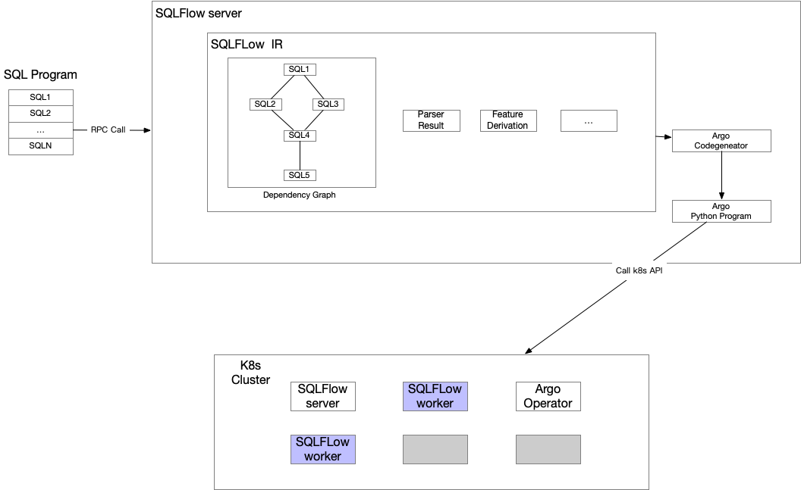

# SQLFlow Workflow Design

## Background

Currently, SQLFLow can access a SQL program which contains multiple SQL statements, SQLFlow server would execute theses SQL statements one by one. But this simple mechanism is not imperfect:

1. There are dependencies between these SQL statements, and if we convert theses SQL statement into a DAG, and execute the parallel node of the DAG in parallel, it can achieve better performance.
1. For each SQL statement, it may have a different dependency environment, difference resource requirement, and we also need a more reliable way to schedule these tasks. [Argo] is Kubernetes Native workflow engine, the better way is making each SQL task as an Argo task and runs it on Kubernetes cluster.

This article would introduce how to implement the workflow in SQLFLow.

## SQLFlow Workflow



From the above figure:

1. The SQLFlow client sends a SQL program across an RPC call to the SQLFlow server.
1. the SQL program goes through a series of IR pipeline to be `SQL Graph` which is a DAG.
1. Argo code generator takes the `SQL Graph` and output an Argo Python program which calls k8s API to schedule the DAG.
1. Each node of the `SQL Graph` runs on the Kubernetes cluster as a Pod.

### SQL Grpah

The input SQL program contains multiple SQL statements, SQLFLow uses
`AnalyzeSQLGraph` to analyze the SQL Program and output a DAG which name is `SQLGraph`, we describe it in SQLFlow as a Go struct, the pseudo-code can be like:

``` golang

type struct SQLGraph {
  nodes []*SQLNode
  edges map[SQLNode][]*Node
}

type struct SQLNode {
  inputTables []string      // input table name, easy to debug
  outputTables []string     // output table name, easy to debug
  value *extendedSelect     // the parser result
}

func AnalyzeSQLGraph(sqls []*extendedSelect) (*SQLGraph, error) {
  ....
}

```

NOTE: This article forces on introducing the workflow in SQLFlow, the details of `AnalyzeSQLGraph` would be introduced in another design doc.

### SQLFLow Worker

The SQLFlow worker node would run on Kubernetes cluster as Pod, each of them would execute one SQL statement, maybe a standard SQL,
TRAIN SQL, PREDICT SQL, etc..., the Pod cmd can be like:

``` bash
sqlflowcmd --datasource=${DATASOURCE} --run ${SQL}
```

`sqlflowcmd` is the SQLFlow command-line toolkit.

### Tempory Table for the Complex SQL

For a complex extended SQL, such as a JOIN SQL:

``` sql
SELECT order.id, customer.name, customer.age, customer.type
FROM order
INSERT JOIN customer ON order.id=customer.id
where customer.age > 18 and customer.age < 35
TRAIN DNNClaissifer
WITH
  ...
LABEL custom.type
INTO custom_model
```

We will separate this SQLFlow SQL into two SQL statements, and two SQLFlow workers would execute each of the two SQL orderly.

1. A Standardered SQL and store the result into a tempory table:

    ``` sql
    CREATE TABLE sqlflow_temporary_01234 AS
    SELECT order.id, customer.name, customer.age, customer.type
    FROM order
    INSERT JOIN customer ON order.id=customer.id
    where customer.age > 18 and customer.age < 35 
    ```

1. An extended SQL to read the temporary table and train the model:

    ``` sql
    SELECT * FROM sqlflow_temporary_01234
    TRAIN DNNClaissifer
    WITH
      ...
    LABEL custom.type
    INTO custom_model
    ```

To split the complex extended SQL has at least two advantages:

1. A machine-learning job may fetch the training data multi-times, which means re-compute the complex SQL for multiple times. If we use a temporary table to store the result, the SQL engine will execute the computation for once.
1. We can launch the machine learning job when the computation SQL is finished.

### Submitting the SQLFlow the Job asynchronously

A SQL program may run for serval hours, days, or even weeks. 
SQLFlow can return a URL which contains the Job ID and status, and users can refresh this URL to watch the job status.
