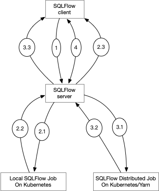

# Highly Available SQLFlow Server

## Motivations

In current implementation, the SQLFlow client submits a SQL program to the SQLFlow server via a gRPC call. The client keeps the gPRC call until the completion of the SQL program. The SQLFlow server translates the received SQL program to a series of submitter programs, and runs the submitter program on the server. 

This implementation has the following pitfalls.

1. Timeout: the SQL program might be a long running job, and the on holding gRPC connection will timeout.
1. Job Persistence: the SQLFlow server owns the running state of SQL program. If the SQLFlow server fails, the SQL program also fails.
1. Job Isolation: different clients shares the same SQLFlow server, one client can affect the other.

We propose the following solutions.

1. To solve timeout: instead of using gRPC long connections, the SQLFlow client communicates with the SQLFlow server in a polling manner.
1. To support Job Persistence & Isolation: instead of running the submitter program locally, SQLFlow server launches an Argo workflow on the Kubernetes cluster.

## High-Level Design

**The server** has two deployment modes: local and cluster. In the **local** mode,

1. On receiving a SQL program, the SQLFlow server
   1. Translates the SQL program to a series of submitter    programs and runs the submitter programs locally in a separate Go routine.
   1. Generates a job token that identifies the running submitter program.
   1. Maintains a mapping from job token to the running submitter program.
   1. Returns the job ID to the client.
1. On receiving a job token, the SQLFlow server
   1. Looks up the associated submitter program.
   1. Returns the most recent results of the submitter program along with a possibly refreshed job token.

In the **cluster** mode,

1. On receiving a SQL program, the SQLFlow server
   1. Translates the SQL program to a series of submitter    programs.
   1. Launches the submitter program as an Argo workflow on the Kubernetes cluster and receives a Argo workflow ID.
   1. Initialize the job token using Argo workflow ID and current fetching step.
   1. Returns the job token to the client.
1. On receiving a job token, the SQLFlow server
   1. Looks up the associated Argo workflow.
   1. Fetches the results of specific workflow step.
   1. Updates the fetching state of the job token.
   1. Returns the results of the submitter program along with a  updated job token.

**The job token** is associated to a running SQL program and the fetching state. The fetching state should be opaque to the client.

**The client** sends the SQL program and receives a job token. In every few seconds, the client fetches the results using the job token, until the SQL program is completed. The client is unaware of the deployment type of the server.



## Proposal Details

### Protocol Buffer Definition

```proto
service SQLFlow {
    // Client calls Run and receives a string job token.
    rpc Run (Request) returns (Job);
    // Client subsequently fetches the result using the job token periodically.
    rpc Fetch(Job) returns (Responses);
}

message Job {
    string token = 1;
}

message Responses {
    JobStatus job_status = 0;
    repeated Response response = 1;
}

message JobStatus {
    enum Code {
        PENDING = 0;
        RUNNING = 1;
        SUCCEEDED = 2;
        FAILED = 3;
        UNKNOWN = 4;
    }
    string message = 0;
}
```

### Client

The client's `execute` function should behave like a single grpc stream call, while the under the hood there are `Run` and multiple `Fetch`s.

```python
def execute(sql):
    job = client.Run(sql)
    while True:
        responses = client.Fetch(job)
        for r in responses.response:
            yield r
        if responses.job_status in (SUCCEEDED, FAILED):
            break
        sleep(some_time)
```

### JobRunner Interface

The `JobRunner` interface should provide two functions `run` and `fetch`:

```go
type JobRunner interface {
  run(sql *req.Sql, pr *PipeReader, pw *PipeWriter) (job string, err error){
  fetchResult(job string) (responses *pb.Responses)
}
```

Register `JobRunner` in `sql.Server`:

```go
func (s *Server) Run (ctx context.Context, req *pb.Request) (*pb.Job, error) {
  db := s.db
  pr, pw := sf.Pipe()
  jobID := s.jobRunner.run(req.Sql, pr, pw)
  return &pb.JobID{jobID: jobID), nil
}

func (s *Server) Fetch (ctx context.Context, jobID *pb.JobID) (*pb.Responses, error) {
  responses, error := s.jobRunner.fetch(jobID.jobID)
  return responses, nil
}

func main() {
  // register `LocalJobRunner` or `KubernetesJobRunner` according to the env variable `SQLFLOW_JOB_RUNNER`
  server.RegisterJobRunner(os.getenv("SQLFLOW_JOB_RUNNER"))
}
```

### LocalJobRunner

Upon processing a `Run` request, the server generates bookkeepers and returns the job ID to the client.
Upon processing a `Fetch` request, the server looks up the result channel and returns the most recent result.

```go
type LocalJobRunner {
  jobs map[string]*PipeReader
}

func (r *LocalJobRunner) run(sql *req.SQL, pr *PipeReader, pw *PipeWriter) (string, error){
  jobID := jobIDGen()
  r.jobs[jobID] = pr
  go func() {
      defer pw.Close()
      pw.Write(`RUNNING`)
      sqlStatements, _ := sf.SplitMultipleSQL(sql)
      for _, singleSQL := range sqlStatements {
         for e := range s.run(singleSQL, db, s.modelDir, req.Session).ReadAll() {
            pw.Write(e)
         }
      }
      pw.Write(`SUCCEEDED`)
  }()
  return jobID, nil
}

func (r *LocalJobRunner) fetch(jobID string) (*pb.Responses, error) (
  responses := &pb.Responses{}
  pr, ok := r.jobs[jobID]
  if !ok {
      return nil, fmt.Errorf("unrecognized jobID %s", jobID)
   }
   for ;; {
      select {
      case res := <-pr.ReadAll():
         // construct result
      case <-time.After(1 * time.Second):
         break;
      }
   }
   return responses, nil
)

```

Since we have multiple gRPC calls for a server instance, we need to maintain a state across different calls.
So we use a map `map[string]*PipeReader` to maintain the job states on the server

### KubernetesJobRunner

Upon processing a `Run` request, the server launches a Kubernetes Pod and returns the Pod ID and Argo UI URL.
Upon processing a `Fetch` request, the server checks the Pod status and returns the `JobStatus` and logs.

```go
type KubernetesJobRunner {
}

func (r *KubernetesJobRunner) run(sql *req.Sql, pr *PipeReader, pw *PipeWriter) (string, error){
  // codegenArgo generates Argo YAML file from the input SQL program.
  workflow, err := codegenArgo(sql)
  // submit the Argo workflow to the Kubernetes cluster.
  jobID, err := r.submitArgoWorkflow(workflow)
  pw.Write(fmt.Sprintf("Argo UI URL: %s", r.argoUI(jobID)))
  return jobID, nil
}

func (r *KubernetesJobRunner) fetch(jobID string) (*pb.Result, error) (
  responses := &pb.Responses{}
  responses.job_status := r.workFlowStatus(jobID)
  logs := r.lastStepLogs(jobID)
  // construct logs message ...
  return responses, nil
)
```

`codegenArgo` generates an Argo multi-steps workflow from the input SQL program. Each step would execute a
single SQL statement.

``` yaml
apiVersion: argoproj.io/v1alpha1
kind: Workflow
metadata:
  generateName: steps-
spec:
  entrypoint: hello-hello-hello

  templates:
  - name: hello-hello-hello
    # Instead of just running a container
    # This template has a sequence of steps
    steps:
    - name: sql1  # sql1 is run before the following steps
      container:
        image: sqlflow/sqlflow 
        command: [sqlflowcmd]
        args: ["-e", "sql1..."]
    - name: sql2 # sql2 run after previous step
      container:
        image: sqlflow/sqlflow 
        command: [sqlflowcmd]
        args: ["-e", "sql2..."]
```

### Dealing with failures

Q: What if the client forgets to fetch? For example, a user hits `ctrl+C` in the Jupyter Notebook right after the `client.Run`.

A: The client can specify a timeout T. The server will kill the corresponding job if the client doesn't fetch in the last T seconds.
