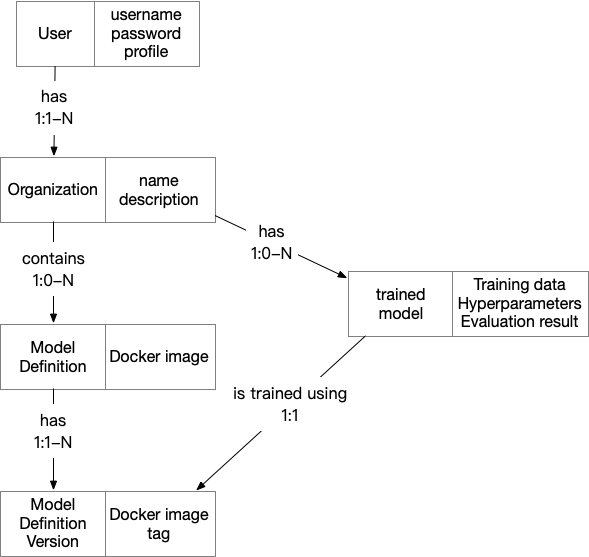
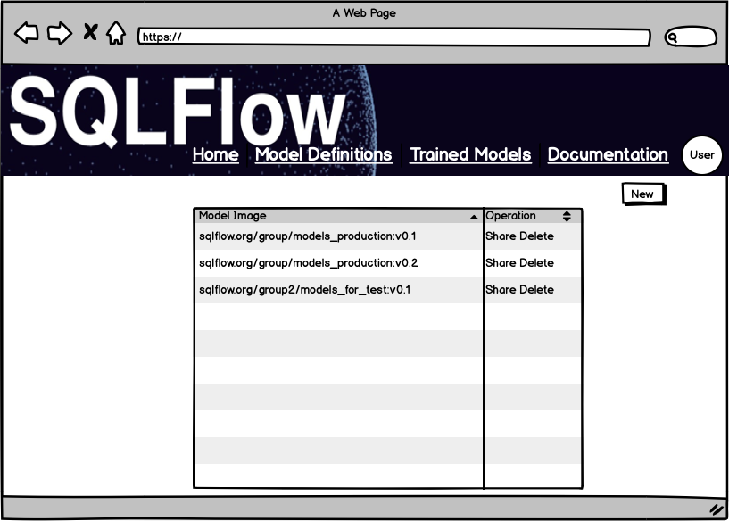
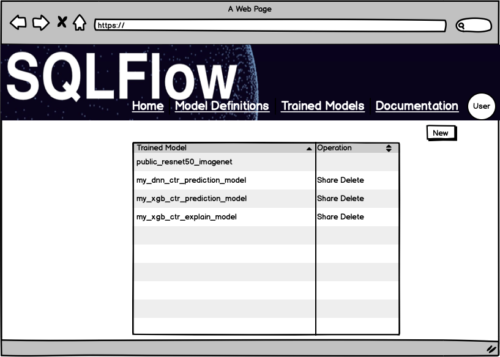
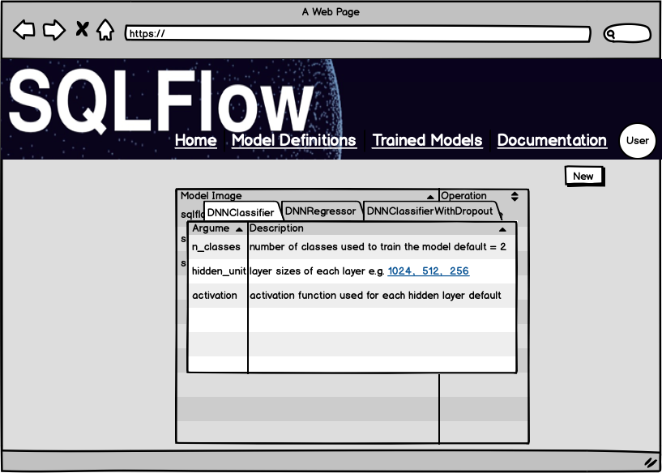
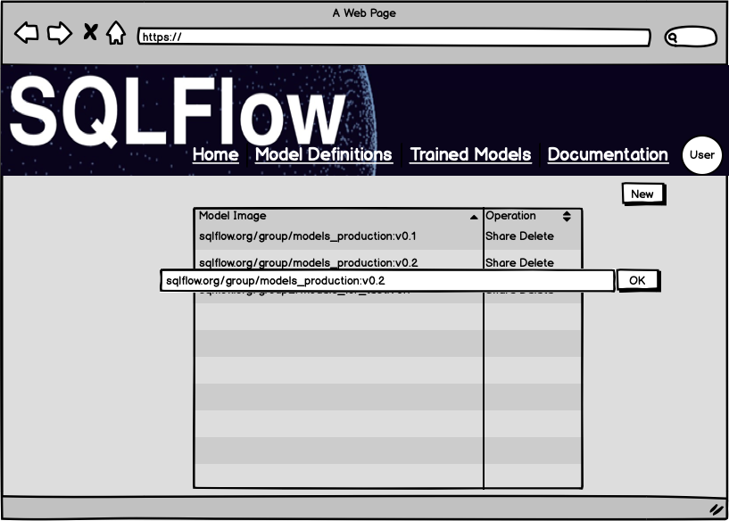
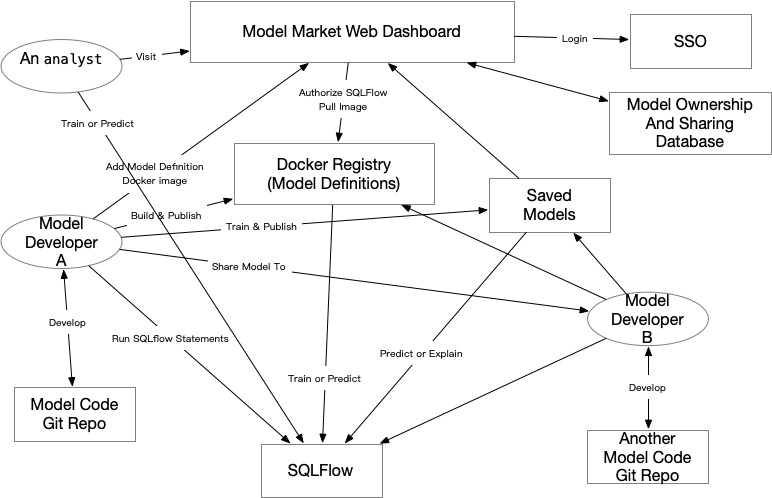

# Model Market

The model market is a place for model developers to share their models and for analysts to find some useful models to do their analysis work. The model market can be deployed anywhere like on the cloud or on-premise with some configurations.

In the [model zoo design](model_zoo.md), we described how model developers develop, publish and share custom models on SQLFlow, and how analysts can make use of the shared model with SQLFlow. **The model market differs from the model zoo by:**

**The model zoo provide all models publicly while the on the model market, users can share the models to a specific group of other users.**

The model market also have a web site to provide graphical interface to share the models. we'll describe how to build the model market for model developers and analysts.

The model market is designed to:

1. Manage user login and logout.
1. View published model definition Docker images available for the current user.
1. View published trained models available for the current user.
1. Publish (or remove) model definition images.
1. Publish (or remove) trained models.
1. Share (or remove share) model definition images to other users.
1. Share (or remove share) trained models to other users.

## Concepts

1. User: model market users have two roles basically:
    1. Model developers: develop publish models available for other users.
    2. Analysts: make use of the models to do analysis jobs.
1. Organization: Each organization can manage several model definitions and trained models. An Organization can have one or many users. Also, an organization can be the user himself (as a personal space).
1. Model definition: a program defines how the model will be trained or predicted, e.g. a Python class of Keras model definition. A model definition is a program, so it has runtime dependencies which will be built into a Docker image using a `Dockerfile`, and the program's releasing version will be represented as the Docker image tag.
1. Trained model: model weights files when the model finishes training, can be used to predict new data. One model definition with a specific version can be used to train many trained models.
1. Authentication: 
    1. For public deployments, the model market will manage user registration itself.
    1. For on-premise deployments, we use a central authentication service like [SSO](https://en.wikipedia.org/wiki/Single_sign-on), so that the user authentication will be consistent with the on-premise environment.
1. Accessibility types of model definitions and trained models:
    1. Private: Visible to the current user and users shared to.
    2. Public: Readable by every user.

**NOTE: model definition and trained models have their own accessibility settings, e.g. a user uploaded a public ResNET model definition, then train the ResNET using a private image dataset, the trained model is set to private and only share to a few people.**

The below figure shows the relationships between entities of the model market:



The model market will use a database (maybe MySQL) to store these entities and relationships. The database design can be done according to the figure.

## Use Cases

### 1. View Model Definitions and Trained Models





1. **Optional**: Login to model market. If the user is not logged in, he can only view public model definitions and trained models.
1. Click at the "Model Definitions" tab to see the list of model definition Docker images and the model class names in each Docker image; click on an entry to see the details of the model definition including available parameters.
1. Click at "Trained Models" tab to see all trained models the current user have published by using SQLFlow `PUBLISH` statement, the evaluation result of the trained model will also be available.

Click at one entry in the list can view the details of the model definition or the trained model:




### 2. Publish a Model Definition Docker Image

1. A model developer develops a new model on some git repository.
1. The model developer writes a Dockerfile describes the model runtime dependencies.
1. The model developer builds a Docker image by running `docker build -t docker.sqlflow.org/mymodel .`.
1. The model developer publishes this Docker image by running `docker push docker.sqlflow.org/mymodel`.

After the Docker image is pushed to the docker registry, he need to add it in the model market by:



1. Login to model market.
1. Go to the "Model Definitions" tab.
1. Click "New" to add a new image.
1. Input the full Docker image address in the dialog and click "OK".
1. ***Optional***: The system will call the Docker registry API to grant access for SQLFlow to pull the image. When using a public image, this step will be skipped. If access can be granted, a message should be shown on the web page.
1. The system will start to run several checks and tests using the Docker image. If all the checks have passed, the image is added.

**NOTE: Docker image with different [tags](https://www.freecodecamp.org/news/an-introduction-to-docker-tags-9b5395636c2a/) will be recognized as different images.**

### 3. Share Model Definition Docker Images to Other Users

1. Login to model market.
1. Go to the "Model Definitions" tab.
1. Find a Docker image in the list to be shared and click on the button "share".
1. Input the user name or user ID to share to and click "OK".

The system will call Docker registry API to grant access for the user shared to after these operations. The model market will save the grant information in a database table `image_shares` that have below columns:

1. `OwnerID`: Docker image owner user ID.
1. `SharedUserID`: User ID that the image is shared to.

### 4. Steps to Publish a Trained Model

The following SQL statement will publish a trained model named `my_first_model` to the model market.

```sql
SQLFLOW PUBLISH my_first_model
    [TO https://models.sqlflow.org/user_name]
```

By running the above statement in SQLFlow, SQLFlow will call the model market API (e.g. https://models.sqlflow.org/publish_trained_model?userid=&model_name=) to upload the trained model to model market website, then the model market will save the trained model on persistent storage like OSS. This persistent storage is managed by the model market, the trained models can only be read by model market API (e.g. https://models.sqlflow.org/get_trained_model?userid=&model_name=). After that ownership information will be written into two database tables (can use a MySQL service in general): the **trained models table** and the **evaluation result table**.

### Authentication When Publish a Model 

For cloud environments like [Aliyun Dataworks](https://data.aliyun.com/product/ide), users are already logged in before submitting SQLFlow statements. So, we can use the same user credential to access the model market which is deployed using the same authentication backend as the cloud environment.

For other environments like the local Docker container, Jupiter notebook, the user will be asked to enter the model market user name and password in order to publish the model.

### Trained Models Table

Once a training job completes, the submitter program adds/updates a row of the trained models' table, which contains (at least) the following fields.

| Field | Type | Description |
| ----- | ---- | ----------- |
| Model ID (or model name) | String | The unique model name, specified by the INTO clause, or `my_first_model` in the example at [model_zoo_design](model_zoo.md). |
| Creator | String | the current user ID |
| Model Definition Image | String | Docker image URL, or `a_data_scientist/regressors` in the above example |
| Model Definition | String | A Python class name, or `DNNRegressor` in the above example. |
| Hyperparameters | String | A JSON format string of hyperparameters used when training the model. |
| Trained Model File Path | String | the path to the trained model parameters on the distributed filesystem (including extra data like vocabulary files), e.g. `oss://bucket/path/to/your_model` |

It is necessary to have the model ID so users can refer to the trained model when they want to use it.  Suppose that the user typed the prediction SQL statement using this model name. SQLFlow server will convert it into a submitter program and run it with the Docker image used to train the model. Therefore, the Docker image ID is also required. The hyperparameters and data converter can be loaded when loading the model weights, helps the prediction submitter to use the conversion rules consistent with the ones used when training.

### The Model Evaluation Table

When publishing a trained model, the evaluation result will be saved to the model evaluation table,
which contains the following fields:

| Field | Type | Description |
| ----- | ---- | ----------- |
| Model ID ( or Model Name ) | String | The unique model name |
| Evaluation Dataset | String | Select statement used to fetch evaluation dataset |
| Metrics | String | JSON format model performance metrics, like `{"Accuracy": 0.9232}` |

Different kinds of models might use various metrics, so the field metrics might be string-typed and saves a JSON, like

```json
{
   "recall": 0.45,
   "precision": 0.734
}
```

## Steps to Share Trained Models to Other Users

1. Login to model market.
1. Go to the "Trained Models" tab.
1. Find a trained model in the list to be shared and click on the button "share".
1. Input the user name or user ID to share to and click "OK".

The model market will save the grant information in a database table `traind_model_shares` that have below columns:

| Field | Type | Description |
| ----- | ---- | ----------- |
| Owner ID | String | trained model owner's user ID |
| SharedUserID | String | User ID that the trained model is shared to |

When one user is trying to use the trained model in an SQLFlow statement, the `sqlflowserver` will first check whether the user is the owner of the trained model or the model has been shared with the user. Or else, `sqlflowserver` will return an error.

## Summarization

The model market can be deployed anywhere like on the cloud or on-premise with some configurations. Even some secret model development can be done by using the model market as a collaboration platform. Either model definitions and trained models are managed securely by SQLFlow and model market, people can get access to your model only if you share it with them.

Below figure shows a overview of how users use the model market for better understanding:



