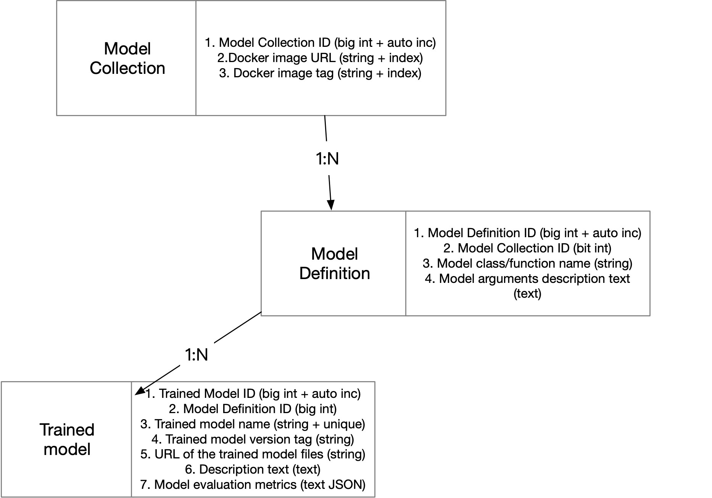

# Model Zoo

## Introduction

SQLFlow extends SQL syntax to allow SQL programmers, a.k.a., analysts, to invoke models defined by Python programmers, a.k.a., data scientists.  For each deployment of SQLFlow service, we refer to the collection of **model definitions** publicly accessible by analysts as a **model zoo**.  A model zoo contains not only the model definitions but also the trained model parameters, as well as the hyperparameters and other information, which are necessary when we use the model for prediction and other analytics jobs.

This document is about how to define models and how to build a model zoo.  For the conclusion, please go to the last section of this document.

## Background

The following example SQL statement shows the syntax for training a model.

```sql
SELECT * FROM employee WHERE onboard_year < 2019
TO TRAIN a_data_scientist/regressors:v0.2/MyDNNRegressor
WITH hidden_units=[10,50,5], lr=0.01
COLUMN gender, scale(age, 0, 1), bucketize(address, 100) 
LABEL salary 
INTO my_first_model;
```

The string `a_data_scientist/regressors:v0.2` names a Docker image, inside which, there is `MyDNNRegressor`, a Python class derived from `tf.keras.Model`, and its dependencies.  The `WITH` clause provides hyperparameters required by the constructor of `MyDNNRegressor`  and the training process. The `COLUMN` clause specifies how to convert the SELECT result, a table, into model inputs in the form of tensors. `LABEL` identifies the field used as the label, in the case of supervised learning.  The training process saves all the above information, plus the estimated model parameters, under the name `my_first_model`.

The following example fills in the column `predicted_salary` of the table `employee` for rows that represent employees recruited in and after 2019.

```sql
SELECT * FROM employee WHERE onboard_year >= 2019 
TO PREDICT employee.predicted_salary
USING my_first_model;
```

Users don't have to write the `COLUMN` clause in the above example, as SQLFlow reuses the one in the training statement.

## Concepts

The above training and prediction example reveals some concepts related to models.

1. A **dataset** is defined and generated by a SQL SELECT statement. For example, `SELECT * FROM employee WHERE onboard_year < 2019`.
1. A **data source** is a table, for example, `employee`.  Please be aware that we can cache and reuse a dataset until its data sources are changed.
1. A **model definition**, for example, `MyDNNRegressor`, is a Python class or other kinds of code that specify a model.
1. A **model repo** is a Docker image that packs a set model definitions. The model repo image is built from an actual code repository where the model developer commit code.
1. The SQL data to model inputs conversion, or **data conversion**, is the COLUMN and optionally LABEL clauses.
1. Hyperparameters
   1. **Model hyperparameters** are some key-value pairs specified in the WITH clause. They are arguments to the constructor of the model definition.
   1. **Training hyperparameters** appear in WITH, as model constructors do. They affect the training process.
   1. **Data conversion hyperparameters** appear in COLUMN and optionally LABEL. For example, the scale range and bucket size in the first example.
1. A **model** consists of all the above concepts and the estimated model parameters.
1. The **model zoo server** is a server that manages releasing, deleting model definitions and models.

In SQLFlow SQL grammar, the identifiers after `TRAIN`, `USING` and `INTO` have different meanings:

1. `TRAIN IDENT`: `IDENT` is the name of a model definition.
1. `USING IDENT`: `IDENT` is the `model ID` referring to a **model**, please refer to the below sections for the definition of `model ID`.
1. `INTO IDENT`: `IDENT` is the `model ID` referring to a **model**.

## The Design

### Versioning and Releasing

A key to this design is to know that both the model definitions and the models have versions. Suppose that an analyst trained a model using the definition in `my_dnn_regressor.py` and got `my_first_model`; soon after that, a data scientist changed `my_dnn_regressor.py` and the analyst re-trained the model into `my_second_model` with slightly modified hyperparameter settings. The analyst must be aware that he should use the same version of `my_dnn_regressor.py` to train these two models. Then if the analyst decides to publish the model `my_second_model` for online prediction, he should choose to use `my_second_model` rather than `my_first_model`.

We can use version management tools like Git and release engineering tools like Docker and save the model with a unique name. Here follows our proposal.

1. A set of model definitions is a Git repository of source files. 
1. To describe dependencies, we require a Dockerfile at the root directory of the repository.
1. To release a repository, we checkout the specific version and run `docker build` and `docker push` with the Dockerfile.
1. Each model is saved under the current user's namespace with a unique name.

### Develop Custom Model Definition

Please refer to [contribute models](../contribute_models.md) section "Define Models as Python Source Code" for details of how to develop a custom model definition. You can manage your model definition with a git repository before releasing it to the model zoo.

### Release the Model Repo Docker Image

When the model developer needs to release the model for SQLFlow to use, run the below command to release your model definitions.

```bash
$ sqlflow release repo my_awesome_model/ model_image:v0.1

checking model is valid ...[OK]
building model docker image with version v0.1 ... [OK]
model built as your-registry.com/public/model_image:v0.1 on https://models.sqlflow.org.
Model added successfully，You can run it `TO TRAIN your-registry.com/public/model_image:v0.1/MyKerasModel`
```

The SQLFlow command-line tool will connect to the model zoo server, upload the files in the folder `my_awesome_model/`. Then the model zoo server will build the Docker image and push it to the pre-configured Docker registry.

If the model repo image `model_image:v0.1` already exists, the above command should fail. To force overwrite the model repo image you should run:

```bash
$ sqlflow release repo -f my_awesome_model/ model_image:v0.1
```

When the model repo goes out of date, you may need to delete it:

```bash
$ sqlflow delete repo model_image:v0.1
```

### Use the Model Repo Docker Image

For a SELECT program using the SQLFlow syntax extension, the SQLFlow server converts it into a [workflow](workflow.md) and submit the workflow job to a workflow engine like Argo/Tekton on Kubernetes. Each step in the workflow is one SQL statement.

By default, we use a default Docker image to run the training, predicting or explaining job. The default Docker image contains pre-made TensorFlow estimator models, Keras models defined in [sqlflow_models repo](https://github.com/sql-machine-learning/models) and XGBoost. To use a custom model repo Docker image, write SQL statements mentioned above:

```sql
SELECT * FROM employee WHERE onboard_year < 2019
TO TRAIN a_data_scientist/regressors:v0.2/MyDNNRegressor
WITH model.hidden_units=[1024,256],
LABEL salary
INTO my_first_model;
```

Then the generated workflow will use the Docker image `a_data_scientist/regressors:v0.2` to run the statement. In this step, SQLFlow will generate the training Python program inside the Docker container and execute it. Once the job completes, **the model together with hyperparameters, Docker image, evaluation result and the SQL statement used will be saved.** So in one model, we can have:

1. The model weights.
1. Docker image URL like `a_data_scientist/regressors:v0.2`.
1. Model class name, like `MyDNNRegressor`.
1. Hyperparameters including model parameters, training parameters, and data conversion parameters.
1. The model evaluation result JSON.
1. The full SQL statement.

### Release a Model

To release the  model for other SQLFlow users, just run:

```bash
$ sqlflow release model my_first_model v0.1

releasing model "my_first_model" with version v0.1 ... [OK]
you can use "models.sqlflow.org/public/my_first_model:v0.1" to access this model.
```

This command will tell the model zoo server to make the model `my_first_model` public available with the version tag `v0.1`. The model zoo server will copy the model and save it in a public place, e.g. a public folder on OSS.

Then, another analyst should be able to use the model by referring to it in its full name.

```sql
SELECT ... TO PREDICT employee.predicted_salary USING models.sqlflow.org/public/my_first_model;
```

Or can use a public model to train on a new dataset:

```sql
SELECT * FROM employee WHERE onboard_year < 2019
TO TRAIN an_analyst/regressors:v0.2/MyDNNRegressor
USING models.sqlflow.org/an_analyst/my_first_model;
```

Samely, when you need to delete the model, just run:

```bash
$ sqlflow delete model my_first_model v0.1
```

## The Model Zoo Server

The model zoo server is responsible to accept SQLFlow command-line's `release` and `delete` command and process as shown below:


- The SQLFlow command line should configure the address of the model zoo server and sqlflow server:
    ```bash
    # ~/.sqlflow/config
    server=192.168.1.1:50051
    modelzoo=https://models.sqlflow.org
    ```
- The model zoo server is connected to an MySQL instance to store publicly available model definitions and models.
- The model zoo server should be configured to connect to one Docker registry (e.g. hub.docker.com) together with the registry's repository and account. The model zoo server can accept below configuration file when starting:
    ```
    registry=hub.docker.com/sqlflow_model_zoo_public/
    username=sqlflow_model_zoo_public
    password=xxxx
    ```
- When releasing a model repo, the model zoo server will get the client uploaded file folder with a `Dockerfile` inside, then:
    1. Check if the Docker image with the same name and tag already exists on the registry.
    1. Try to validate whether the contents of the folder have valid model definitions by checking the exported classes, if the class is a sub class of `tf.keras.Model` or if the name is a function that returns an object of `tf.keras.Model`, it is valid.
    1. Run `docker build` to build a Docker image with the image name and tag specified by the user command.
    1. Run `docker push` to push the Docker image to the Docker registry. The pushed image should be publicly readable.
    1. Write a row in the MySQL instance to recored this model repo Docker image.
- When releasing a model, the model zoo server will:
    1. Copy the model parameters together with all nessesary metadatas to the public storage. For PAI deployments, we use a public folder on the OSS; For other deployments we use a public database space on the database system, each table in the public database stores a model.
    1. Write an recored in the MySQL instance to recored the model URI and the model's name. The URI should be like `oss://bucket/path/to/your/model/` or `mysql://ip:port/database/table` to point to the actual place that stores the public model.
- When deleting a model repo image or a model, do the reverse. **Note that we do not really delete the record in MySQL, yet we set the `deleted` flag so that the deleted model repo or model will not be listed. Then if some one is using a model trained by a deleted model repo, the model can still be available.**

### Model Zoo Server Database Schema

We create three tables using the schema described in the below figure:

1. Table `model_repos` stores model repo Docker images with it's corresponding version tags.
2. Table `model_definitions` stores model repo details provided by each Docker image. Note that each Docker image may have multiple model definition classes or functions.
3. Table `models` stores the unique name of the model and a URL point to where the model is actually saved. Note that each model repo can be used to train multiple models.




### Model Zoo Server RPC Protocol

Please refer to [modelzooserver.proto](../../pkg/proto/modelzooserver.proto) for the RPC protocol design and explanations.

## Summarization

There are three roles in the ecosystem of SQLFlow: 

1. the tool developers who use Go/C++ to create SQLFlow,
1. the model developers, or data scientists, who use Python to define, say, Keras models, and
1. the analysts, who use SQL to train models, or to use trained models for prediction or model explanation.


Any data scientist can create an arbitrary number of Docker images, and in each Docker image, there could be any number of model definitions (classes or functions defines the model structure). There are some concepts from the perspective of a data scientist `a_data_scientist`:

1. Develop model definitions in a Git repo as the "model repo", say, `github.com/a_data_scientist/regressors`.
1. Release the model repo to SQLFlow using the command `sqlflow release modeldef -f my_awesome_model/ model_image:v0.1`
1. Do model training experiments untils a model is ready to release.
1. Release the model using the command `sqlflow release model my_first_model v0.1`.

From the perspective of an analyst, say, `an_analyst`, who is going to use the model definition `DNNRegressor` defined in `github.com/a_data_scientist/regressors`, s/he could refer to the model definition by

- `dockerhub.com/a_data_scientist/regressor:v0.2/DNNRegressor`, which is the full name,
- `dockerhub.com/a_data_scientist/regressor/DNNRegressor`, if the Docker image tag is `latest`,
- `a_data_scientist/regressor/DNNRegressor`, if `dockerhub.com` is the default Docker registry, or
- `regressor/DNNRegressor`, if the user is the model developer `a_data_scientist`.

A model could have its name in any of the following forms:

- my_first_model
- an_analyst/my_first_model
- models.sqlflow.org/an_analyst/my_first_model

`models.sqlflow.org` is the default model zoo server address.
