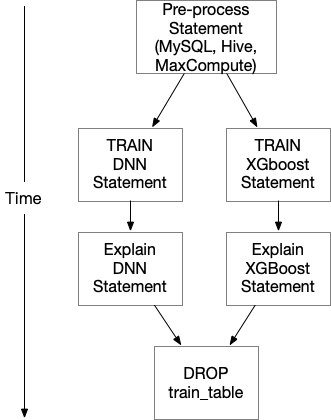
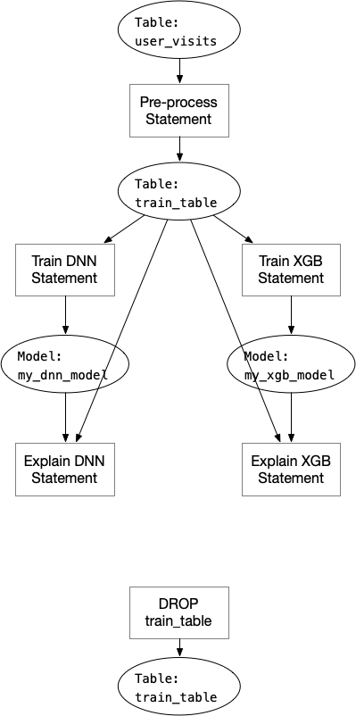

# SQL Program Dependency Analyze

Consider the SQL program shown below, which may be a common case to construct a full
AI pipeline using pure SQL (with SQLFlow). The below SQL program is trying to:

1. Preprocess the original data and put the data in one temp table for training
2. Train one DNN model and one XGBoost model.
3. Run model explanation on both models for later analysis work.
4. Clean up the training table.

```sql
-- random sampling 1,000,000 samples from one month's data,
-- fill in empty data, and put the result to "training_data"
CREATE TABLE training_data AS
SELECT COALESCE(field1, 0), COALESCE(NULLIF(field2, ""), 0) label
FROM user_visits
WHERE dt<'20200313' and dt>'20200213'
ORDER BY RAND() LIMIT 1000000;
-- do model training
SELECT * FROM training_data
TO TRAIN DNNClassifier
WITH model.n_classes=2, model.hidden_units=[4096,1024,256]
LABEL 'label'
INTO my_dnn_model;
-- train another model using XGBoost
SELECT * FROM training_data
TO TRAIN xgboost.gbtree
WITH objective="binary:logistic"
LABEL 'label'
INTO my_xgb_model;
-- generate explain results for both model for analyze
SELECT * FROM training_data ORDER BY RAND() LIMIT 10000
TO EXPLAIN my_dnn_model;

SELECT * FROM training_data ORDER BY RAND() LIMIT 10000
TO EXPLAIN my_xgb_model;

-- clean up training table
DROP TABLE training_data;
```

It's simple to figure out that we can run the two training statement concurrently, and run the
corresponding explain statement when one training statement finishes. The execution flow should
look like:



## Analyze the SQL Program Execution Dependency

By analyzing the SQL program, we are able to figure out which statements can be executed
concurrently. Since the SQL statements are often submitted to a distributed cluster like
Hive or MaxCompute. Running the SQL statements concurrently can make full use of the cluster
computing resource, shrink the execution time.

To achieve this, we need to analyze the hole SQL program and find out what tables are manipulated
by each statement. One statement can read, write or do both on some tables, while other statements
can also read, write the same table, in the above case, statement 1 is reading table `user_visits`
and writing table `training_data`, statement 2,3,4,5 are reading table `training_data`, so they must
start only when statement 1 is finished.

We can do this by following below steps:

1. Parse every SQL statement, return a map recording read/write type of the tables that the current
   statement is manipulating. We'll get a list of this map in order, representing each SQL statement.
   This will be done in the third-party parsers.
2. Parse the SQLFlow extended SQL if there are any, return a similar map recording read/write type
   of the models of the current statement (in our Go parser).
3. Construct a graph using the following rules:
    1. The statements are nodes in the graph, they should run in the original order.
    2. If one statement reads a table/model, then construct one graph edge from statements that write
       the table to the current statement.
4. Execute this graph by submitting the graph as an Argo/Tekton workflow, each step is one single
   statement.

## Analyze SQL Statement Input and Output Tables

To analyze the input and output tables for each statement, we call the external parsers (Hive,
Calcite, MySQL) to get the AST (https://en.wikipedia.org/wiki/Abstract_syntax_tree), for statements
that have SQLFlow extended syntax like `TO TRAIN`, we'll analyze the standard SQL statement part in
the external parsers and then analyze the model read and write using the SQLFlow extended parser.

When going through the SQL statement, we should identify table read or write following below rules:

- table reads:
   1. `SELECT <hints> FROM <table_name>`: reads table `<table_name>`.
   1. `SELECT <hints> FROM <table_name> <AS> <table_alias>`: reads table `<table_name>`.
   1. `SELECT ... LEFT JOIN <table_name>`: reads `<table_name>`. Same as `INNER JOIN`, `RIGHT JOIN`,
      `FULL JOIN`, `SELF JOIN`, `UNION`.
- table writes:
   1. `CREATE TABLE <table_name> AS <SELECT Query>`: writes table `<table_name>`.
   1. `INSERT INTO <table_name> ...`: writes table `<table_name>`.
   1. `UPDATE <table_name> ...`: writes table `<table_name>`.
   1. `DELETE FROM <table_name> ...`, `TRUNCATE ...`: writes `<table_name>`.
   1. `ALTER TABLE <table_name>`: writes `<table_name>`.


## Analyzing Database Context

Some SQL program has `USE` clause which defines the database the following SQL statements are using.

```SQL
USE db;
CREATE TABLE my_table AS ...
SELECT * FROM my_table TO TRAIN ...
USE db2;
SELECT * FROM my_table_in_db2 TO TRAIN ...
```

We need to go over the SQL program and get the last `USE` for each SQL statement, and modify the table
name without prefix `db.` to `db.table` in above step after we get the input/output tables for each
statement, so that we return the table read/write information with table full name `db.table`.

Note that external parsers do not support `USE` statement, we can do this simply by split the SQL
program by `;` and using regex to match if the statement is like `USE db_identifier`.

## Hazard

SQL program is just like normal computer programs. We treat tables as variables in our case.
Analyzing computer programs always have hazards: https://en.wikipedia.org/wiki/Hazard_(computer_architecture). In the example above, we can construct a graph like below:



Note that the last "DROP TABLE" statement must execute after the two "Explain" statements, because
the table is used by the explain statements before it could be changed (in this case, deleted). This
case is called "Write After Read". To solve this kind of data hazards, we can add one dependency node
"table WAR" between the explain statements and drop statement:


We also need to solve "Write After Write" hazard just like "Write After Read" if the SQL program has
this situation.

## Implementation

In order to construct the dependency graph of the SQL program, we need to analyze the parsed SQL
statements in every parser, including MySQL parser, Hive parser, calcite parser, and SQLFlow extended
parser. Since the Hive parser and calcite parser is written in Java, we need to pass the table read/write
information from Java to Go:

```proto
// InputOutputTables represents input and output tables a statement manipulates.
message InputOutputTables {
   repeated string input_tables = 1;
   repeated string output_tables = 2;
}

message ParserResponse {
  repeated string sql_statements = 1;
  int32 index = 2;
  string error = 3;
  // return tables that each statement manipulates.
  repeated InputOutputTables input_output_tables = 4;
}
```

When parsing the SQL program in Go, we can then get table read/write information for each standard
SQL statement, then parse the extended SQL to get model read/write information, then construct the
graph:

```go
// pkg/ir/deps/sql_program_deps_graph.go
package deps
// SQLProgramGraph is the constructed graph of the SQL program.
type SQLProgram struct {
  Statements []*Statement
}

type Statement struct {
   Statement ir.SQLFlowStmt
   // Statement's input/output must be a table.
   Inputs []*Table
   Outputs []*Table
}

type TableType string

const(
    TableType Table = "table"
    Model = "model"
)

type Table struct {
  // Type can be "table" or "model".
  Type TableType
  Name string
  // Table's input/output must be a statement.
  Inputs *[]Statement
  Outputs *[]Statement
}

func (t *Table) FullName() string {
    return t.Type + "." + t.Name
}

// Analyze will construct a dependency graph for the SQL program and
// returns the first statement (root node).
func Analyze(program []ir.Statement) (*deps.Statement, error) {}
```

**NOTE: we treat table and model as the same thing when constructing the graph.**
**The actual table name in the graph is "Type.Name", because we may save the model in OSS storage**
**rather than in a table, if the model name is the same as some table name, there's no dependency**
**between them.**

Then the [workflow package](https://github.com/sql-machine-learning/sqlflow/blob/develop/doc/design/workflow_package.md#workflow-codegen)
can use the constructed graph to generate Argo/Tekton YAML to submit to Kubernetes cluster for execution:

```Go
GenCode(*deps.Statement) string // generate couler/fluid code for the graph
GenYAML(string) string // execute couler/fluid Python code and generate Argo/Tekton YAML
```

Submit the YAML to Kubernetes then the workflow with dependency will start to execute.
