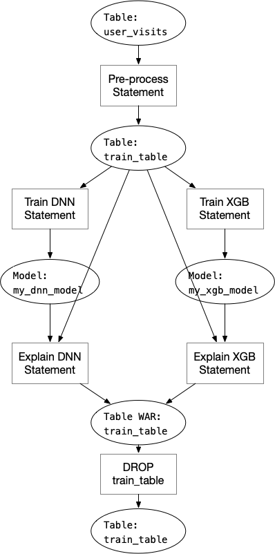

# SQL Program Dependency Analyze

Consider the SQL program shown below, which may be a common case to construct a full
AI pipeline using pure SQL (with SQLFlow). The below SQL program is trying to:

1. Preprocess the original data and put the data in one temp table for training
2. Train one DNN model and one XGBoost model.
3. Run model explanation on both models for later analysis work.
4. Clean up the training table.

```sql
-- random sampling 1,000,000 samples from one month's data,
-- fill in empty data, and put the result to "train_table"
CREATE TABLE train_table AS
SELECT COALESCE(field1, 0), COALESCE(NULLIF(field2, ""), 0) label
FROM user_visits
WHERE dt<'20200313' and dt>'20200213'
ORDER BY RAND() LIMIT 1000000;
-- do model training
SELECT * FROM train_table
TO TRAIN DNNClassifier
WITH model.n_classes=2, model.hidden_units=[4096,1024,256]
LABEL 'label'
INTO my_dnn_model;
-- train another model using XGBoost
SELECT * FROM train_table
TO TRAIN xgboost.gbtree
WITH objective="binary:logistic"
LABEL 'label'
INTO my_xgb_model;
-- generate explain results for both model for analyze
SELECT * FROM train_table ORDER BY RAND() LIMIT 10000
TO EXPLAIN my_dnn_model;

SELECT * FROM train_table ORDER BY RAND() LIMIT 10000
TO EXPLAIN my_xgb_model;

-- clean up training table
DROP TABLE train_table;
```

It's simple to figure out that we can run the two training statement concurrently, and run the
corresponding explain statement when one training statement finishes. The execution flow should
look like:

<p align="center">

</p>

## Analyze the SQL Program Execution Dependency

By analyzing the SQL program, we are able to figure out which statements can be executed
concurrently. Since the SQL statements are often submitted to a distributed cluster like
Hive or MaxCompute. Running the SQL statements concurrently can make full use of the cluster
computing resource, shrink the execution time.

To achieve this, we need to analyze the hole SQL program and find out what tables are manipulated
by each statement. One statement can read, write or do both on some tables, while other statements
can also read, write the same table, in the above case, statement 1 is reading table `user_visits`
and writing table `train_table`, statement 2,3,4,5 are reading table `train_table`, so they must
start only when statement 1 is finished.

We can do this by following below steps:

1. Parse every SQL statement, return a map recording read/write type of the tables that the current
   statement is manipulating. We'll get a list of this map in order, representing each SQL statement.
   This will be done in the third-party parsers.
2. Parse the SQLFlow extended SQL if there are any, return a similar map recording read/write type
   of the models of the current statement (in our Go parser).
3. Construct a graph using the following rules:
    1. The statements are nodes in the graph, they should run in the original order.
    2. If one statement reads a table/model, then construct one graph edge from statements that write
       the table to the current statement.
4. Execute this graph by submitting the graph as an Argo/Tekton workflow, each step is one single
   statement.


## Hazard

SQL program is just like normal computer programs. We treat tables as variables in our case.
Analyzing computer programs always have hazards: https://en.wikipedia.org/wiki/Hazard_(computer_architecture). In the example above, we can construct a graph like below:

<p align="center">

</p>


Note that the last "DROP TABLE" statement must execute after the two "Explain" statements, because
the table is used by the explain statements before it could be changed (in this case, deleted). This
case is called "Write After Read". To solve this kind of data hazards, we can add one dependency node
"table WAR" between the explain statements and drop statement:

<p align="center">

</p>

We also need to solve "Write After Write" hazard just like "Write After Read" if the SQL program has
this situation.

## Implementation

In order to construct the dependency graph of the SQL program, we need to analyze the parsed SQL
statements in every parser, including MySQL parser, Hive parser, calcite parser and SQLFlow extended
parser. Since the Hive parser and calcite parser is written in Java, we need to pass the table read/write
information from Java to Go:

```proto
message TableRW {
  string table_name = 1;
  // read: rw_type = 0 
  // write: rw_type = 1
  // both : rw_type = 2
  int32 rw_type = 2;
}

message TableRWList {
  repeated TableRW table_rw_list = 1;
}

message ParserResponse {
  repeated string sql_statements = 1;
  int32 index = 2;
  string error = 3;
  // Add table_rw field
  repeated TableRWList table_rw = 4;
}
```

When parsing the SQL program in Go, we can then get table read/write information for each standard
SQL statement, then parse the extended SQL to get model read/write information, then construct the graph.
