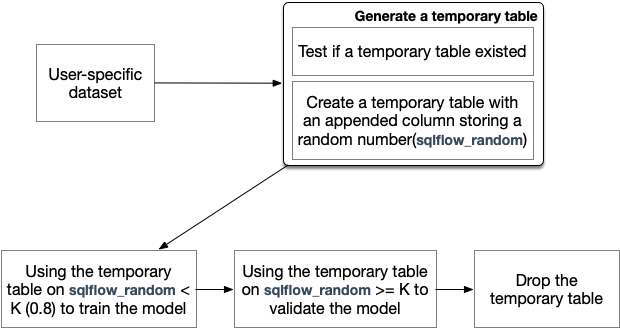

# Training and Validation

A common ML training job usually involves two kinds of data sets: training data and validation data. These two data sets will be generated automatically by SQLFlow through randomly splitting the select results.

## Overall
SQLFlow generates a temporary table following the user-specific table, trains and evaluates a model.



Notice, we talk about the **train** process in this post.

## Generate a Temporary Table
Splitting the training table into training data and validation data is the key point. We suppose SQLFlow are dealing with the following SQL to train an ML model:

```SQL
SELECT col1, col2, col3
FROM mytable
TO TRAIN ...
```

The data comes from the standard select part `SELECT col1, col2, col3 FROM mytable`, and let's say the query result looks like the following

| col1   | col2   | col3   |
| ------ | ------ | ------ |
| \<data\> | \<data\> | \<data\> |
| \<data\> | \<data\> | \<data\> |
| | ... | |
We want to split the result into 80% training data and 20% validation data.

**We add a column sqlflow_random via RAND() and save the result to a temporary table**

Note the `RAND()` function returns a random number between 0 (inclusive) and 1. The result temporary table looks like the following.

<table>
  <tr>
    <th colspan="4">temp_table</th>
  </tr>
  <tr>
    <td>col1</td>
    <td>col2</td>
    <td>col3</td>
    <td>sqlflow_random</td>
  </tr>
  <tr>
    <td>&lt;data&gt;</td>
    <td>&lt;data&gt;</td>
    <td>&lt;data&gt;</td>
    <td>0.350812148722645</td>
  </tr>
  <tr>
    <td>&lt;data&gt;</td>
    <td>&lt;data&gt;</td>
    <td>&lt;data&gt;</td>
    <td>0.9845468606655923</td>
  </tr>
  <tr>
    <td>&lt;data&gt;</td>
    <td>&lt;data&gt;</td>
    <td>&lt;data&gt;</td>
    <td>0.650812148722645</td>
  </tr>
  <tr>
    <td></td>
    <td>...</td>
    <td></td>
    <td></td>
  </tr>
</table>


We can generate the corresponding SQL using the following code template
```SQL
CREATE TABLE {.TempTableName} AS
    SELECT *, RAND() AS sqlflow_random FROM (
        {.NormalStmt}
    )
```

**Naming temporary table**

Because multi-users run SQLFlow with their own isolated data set at the same time, SQLFlow generates an elaborate name for the temporary table to avoid conflict.
- For Maxcompute
SQLFlow saves the temporary table into the current project which must be specified by the user.
Meanwhile, we specify the [LIFECYCLE](https://www.alibabacloud.com/help/en/doc-detail/55297.htm) to 14 days to release the temporary table automatically.

- For common databases, like MySQL, Hive
SQLFlow creates an own database as workspace, like `sqlflow_workspace`, then creates the temporary table in `sqlflow_workspace`.

  Notice: Why doesn't SQLFlow [create TEMPORARY table](https://dev.mysql.com/doc/refman/8.0/en/create-temporary-table.html) to act the *TempTable*?
  Because SQLFlow creates *TempTable* in Go and read the contents in Python. They are different sessions, which means the *TempTable* is invisible to each other.

## How to Split

**We fetch the training/validation data using two different queries respectively.**

The query for training data can be written as `SELECT * FROM temp_table WHERE sqlflow_random < 0.8`, which fetches row1 and row3 etc.. The query for validation data can be written as `SELECT * FROM temp_table WHERE sqlflow_random >= 0.8`, which fetches the rest of the rows.

In SQLFlow, we modify the user-specific data set to our temp_table restricted to `sqlflow_random >= 0.8` to train a model, then restricted the temp_table to `sqlflow_random < 0.8` to validate that model. This context is built after the temporary data set accomplished, passed to `runExtendedSQL`  in `extendedSelect`.

```Go
type extendedSelect struct {
    // ...
    training   standardSelect // training data set
    validation standardSelect // validation data set
}
```

## Codegen
For TensorFlow submitter, SQLFlow generate training data set and validation data set according to `extendedSelect.training` and `extendedSelect.validation`.

## Release the Temporary Table
In the end, SQLFlow remove the temporary table to release resources.

- For Maxcompute
  SQLFlow specify the [LIFECYCLE](https://www.alibabacloud.com/help/en/doc-detail/55297.htm) to 14 days in the create statement, so as to release the temporary table automatically.

- For common databases, like MySQL, Hive
  After the training job, SQLFlow release the temporary table by
  ```SQL
  drop table if exists {temporary_table_name}
  ```
  So, SQLFlow need to know when the training job is completed. Whether it is a synchronized job or an asynchronous job.

## Notes

- If the column sqlflow_random already exists, SQLFlow chooses to quit
  Notice, *column name started with an underscore is invalid in the hive*
- Any discussion to implement a better splitting is welcomed
