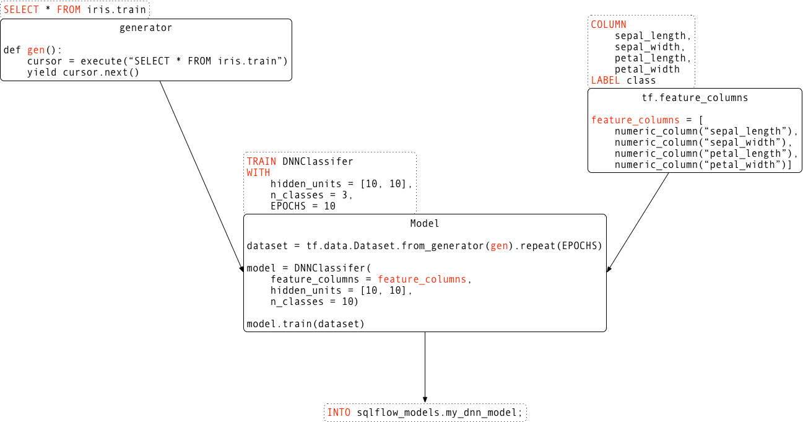

# SQLFlow Language Guide

SQLFlow is a bridge that connects a SQL engine (e.g., MySQL, Hive, or MaxCompute) and TensorFlow and other machine learning toolkits.  SQLFlow extends the SQL syntax to enable model training, prediction, and analysis.

This language guide elaborates SQLFlow extended syntax and feature column API. For specific examples, please refer to [the tutorial](tutorial/iris-dnn.md).

## Overview

Let's assume [iris flower data set](https://en.wikipedia.org/wiki/Iris_flower_data_set) stored in table `iris.train`. The first four columns (petal_length, petal_width, sepal_length, sepal_width) represent the features and the last column (class) represents the labels.

 sepal_length | sepal_width | petal_length | petal_width | class
--------------|-------------|--------------|-------------|--------
 6.4          | 2.8         | 5.6          | 2.2         | 2
 5.0          | 2.3         | 3.3          | 1.0         | 1
 ...          | ...         | ...          | ...         |

Let's train a `DNNClassifier`, which has two hidden layers where each layer has ten hidden units, and then save the trained model into table `sqlflow_models.my_dnn_model` for making predictions later on.

Instead of writing a Python program with a lot of boilerplate code, this can be achieved easily via the following statement in SQLFlow.

```sql
SELECT * FROM iris.train
TO TRAIN DNNClassifier
WITH model.hidden_units = [10, 10], model.n_classes = 3, train.epoch= 10
COLUMN sepal_length, sepal_width, petal_length, petal_width
LABEL class
INTO sqlflow_models.my_dnn_model;
```

SQLFlow will then parse the above statement and translate it to an equivalent Python program.



## Training Syntax

A SQLFlow training statement consists of a sequence of select, train, column, label, and into clauses.

```sql
SELECT select_expr [, select_expr ...]
FROM table_references
  [WHERE where_condition]
  [LIMIT row_count]
TO TRAIN model_identifier
[WITH
  model_attr_expr [, model_attr_expr ...]
  [, train_attr_expr ...]]
COLUMN column_expr [, column_expr ...]
  | COLUMN column_expr [, column_expr ...] FOR column_name
    [COLUMN column_expr [, column_expr ...] FOR column_name ...]
[LABEL label_expr]
INTO table_references;
```

The select statement describes the data retrieved from a particular table, e.g., `SELECT * FROM iris.train`.

```sql
SELECT select_expr [, select_expr ...]
FROM table_references
  [WHERE where_condition]
  [LIMIT row_count]
```

According to [ANSI SQL Standards](https://www.whoishostingthis.com/resources/ansi-sql-standards/),

- each *select_expr* indicates a column that you want to retrieve. There must be at least one *select_expr*.
- *table_references* indicates the table from which to retrieve rows.
- *where_condition* is an expression that evaluates to true for each row to be selected.
- *row_count* indicates the maximum number of rows to be retrieved.

For example, if you want to quickly prototype a binary classifier on a subset of the sample data, you can write
the following statement:

```sql
SELECT *
FROM iris.train
WHERE class = 0 OR class = 1
LIMIT 1000
TO TRAIN ...
```

### Train Clause

The *train clause* describes the specific model type and the way the model is trained, e.g. `TO TRAIN DNNClassifier WITH model.hidden_units = [10, 10], model.n_classes = 3, train.epoch= 10`.

```sql
TO TRAIN model_identifier
WITH
  model_attr_expr [, model_attr_expr ...]
  [, train_attr_expr ...]
```

- *model_identifier* indicates the model type. e.g. `DNNClassifier`. Please refer to [Models](#models) for a complete list of supported models.
- *model_attr_expr* indicates the model attribute. e.g. `model.n_classes = 3`. Please refer to [Models](#models) for details.
- *train_attr_expr* indicates the training attribute. e.g. `train.epoch = 10`. Please refer to [Hyperparameters](#hyperparameters) for details.

For example, if you want to train a `DNNClassifier`, which has two hidden layers where each layer has ten hidden units, with ten epochs, you can write the following statement:

```sql
SELECT ...
TO TRAIN DNNClassifier
WITH
  model.hidden_units = [10, 10],
  model.n_classes = 3,
  train.epoch = 10
...
```

### Column Clause

The *column clause* indicates the field name for training features, along with their optional pre-processing methods, e.g. `COLUMN sepal_length, sepal_width, petal_length, petal_width`.

```sql
COLUMN column_expr [, column_expr ...]
  | COLUMN column_expr [, column_expr ...] FOR column_name
    [COLUMN column_expr [, column_expr ...] FOR column_name ...]
```

- *column_expr* indicates the field name and the preprocessing method on the field content. e.g. `sepal_length`, `DENSE(dense, 3)`. Please refer to [Feature columns](#feature-columns) for preprocessing details.
- *column_name* indicates the feature column names for the model inputs. Some models such as [DNNLinearCombinedClassifier](https://www.tensorflow.org/api_docs/python/tf/estimator/DNNLinearCombinedClassifier) have`linear_feature_columns` and `dnn_feature_columns` as feature column input.

For example, if you want to use fields `sepal_length`, `sepal_width`, `petal_length`, and `petal_width` as the features without any pre-processing, you can write the following statement:

```sql
SELECT ...
TO TRAIN ...
COLUMN sepal_length, sepal_width, petal_length, petal_width
...
```

### Label Clause

The *label clause* indicates the field name for the training label, along with their optional pre-processing methods, e.g. `LABEL class`.

```sql
LABEL label_expr
```

- *label_expr* indicates the field name and the pre-processing method on the field content, e.g. `class`. For unsupervised learning job, we should skip the label clause.

Note: some field names may look like SQLFlow keywords. For example, the table may contain a field named "label". You can use double quotes around the name `LABEL "label"` to work around the parsing error.

### Into Clause

The *into clause* indicates the table name to save the trained model into:

```sql
INTO table_references
```

- *table_references* indicates the table to save the trained model. e.g. `sqlflow_model.my_dnn_model`.

Note: SQLFlow team is actively working on supporting saving model to third-party storage services such as AWS S3, Google Storage, and Alibaba OSS.

### Feature Columns

SQLFlow supports specifying various feature columns in the column clause and label clause. Below are the currently supported feature columns:

 feature column type | usage | field type | example
---|---|---|---
 X | field | int/float/double | 3.14
 DENSE | DENSE(field, n[,delimiter]) | string/varchar[n] | "0.2,1.7,0.6"
 SPARSE | SPARSE(field, n[,delimiter]) | string/varchar[n] | "3,5,7"
 CATEGORY_ID | CATEGORY_ID(field, n[,delimiter]) | string/varchar[n] | "66,67,42,68,48,69,70"
 SEQ_CATEGORY_ID | SEQ_CATEGORY_ID(field, n[, delimiter]) | string/varchar[n] | "20,48,80,81,82,0,0,0,0"
 EMBEDDING | EMBEDDING(category_column, dimension[, combiner]) | X | X

```text
DENSE(field, n[, delimiter=comma])
/*
DENSE converts a delimiter separated string to a n dimensional dense tensor.
    field:
        A string specifying the field name of the standard select result.
        e.g. dense, column1.
    n:
        An integer specifying the tensor dimension.
        e.g. 12, [3,4].
    delimiter:
        A string specifying the delimiter.
        default: comma.

Example:
    DENSE(dense, 3). "0.2,1.7,0.6" => Tensor(0.2, 1.7, 0.6)

Error:
    Invalid field type. Field type has to be string/varchar[n].
    Invalid dimension. E.g. convert "0.2,1.7,0.6" to dimension 2.
*/

SPARSE(field, n[, delimiter=comma])
/*
SPARSE converts a delimiter separated string to a n dimensional sparse tensor,
whose values are 0 or 1. The numbers in the string are the indices where the 
tensor values are 1.
   field:
       A string specifying the field name of the standard select result.
       e.g. sparse_column, column1.
   n:
       An integer specifying the tensor dimension.
       e.g. 12.
   delimiter:
       A string specifying the delimiter.
       default: comma.

Example:
   SPARSE(sparse_column, 8). "3,5,7" => Tensor(0, 0, 0, 1, 0, 1, 0, 1)

Error:
   Invalid field type. Field type has to be string/varchar[n].
*/

CATEGORY_ID(field, n[, delimiter=comma])
/*
CATEGORY_ID splits the input field by delimiter and returns identity values.
    field:
        A string specifying the field name of the standard select result.
        e.g. title, id, column1.
    n:
        An integer specifying the number of buckets
        e.g. 12, 10000.
    delimiter:
        A string specifying the delimiter.
        default: comma.

Example:
    CATEGORY_ID(title, 100). "1,2,3,4" => Tensor(1, 2, 3, 4)

Error:
    Invalid field type. Field type has to be string/varchar[n].
*/


SEQ_CATEGORY_ID(field, n[, delimiter=comma])
/*
SEQ_CATEGORY_ID splits the input field by delimiter and returns identity values.
    field:
        A string specifying the field name of the standard select result.
        e.g. title, id, column1.
    n:
        An integer specifying the number of buckets
        e.g. 12, 10000.
    delimiter:
        A string specifying the delimiter.
        default: comma.

Example:
    SEQ_CATEGORY_ID(title, 100). "1,2,3,4" => Tensor(1, 2, 3, 4)

Error:
    Invalid field type. Field type has to be string/varchar[n].
*/


EMBEDDING(category_column, n[, combiner])
/*
EMBEDDING converts a delimiter separated string to an n-dimensional tensor.
    category_column:
        A category column created by CATEGORY_ID*
        e.g. CATEGORY_ID(title, 100).
    n:
        An integer specifying the dimension of the embedding, must be > 0.
        e.g. 12, 100.
    combiner:
        A string specifying how to reduce if there are multiple entries in a single row.

Example:
    EMBEDDING(CATEGORY_ID(news_title,16000,COMMA), 3, mean). "1,2,3" => Tensor(0.2, 1.7, 0.6)
*/
```

## Prediction Syntax

A SQLFlow prediction statement consists of a sequence of select, predict, and using clauses.

```sql
SELECT select_expr [, select_expr ...]
FROM table_references
  [WHERE where_condition]
  [LIMIT row_count]
TO PREDICT result_table_reference
[WITH
  attr_expr [, attr_expr ...]]
USING model_table_reference;
```

**Please be aware that the `SELECT ...` statement before the `TO PREDICT ...` and `TO EXPLAIN ...` clause must generate the same data schema as the one before the `TO TRAIN` clause does. This requirement ensures that the data used in prediction has the same schema as those used in training.**

The select statement syntax is the same as the select statement syntax in the training syntax. SQLFlow uses the column name to guarantee the prediction data has the same order as the training data. For example, if we have used `c1`, `c2`, `c3` and `label` column to train a model, the select statement in the prediction job should also retrieve columns that contain exactly the same names.

### Predict and Using Clause

The *predict clause* describes the result table that a prediction job should write to, the table a prediction job should load the model from, and necessary configuration attributes for a prediction job.

```
TO PREDICT result_table_reference
[WITH
  attr_expr [, attr_expr ...]]
USING model_table_reference;
```

- *result_table_reference* indicates the table to store the prediction result. Please be aware that all the data retrieved by the select statement plus the prediction result will be stored.
- *attr_expr* indicates the configuration attributes, e.g. `predict.batch_size = 1`.
- *model_table_reference* indicates the table a prediction job should load the model from.

For example, if we want to save the predicted result into table `iris.predict` at column `class` using the model stored at `sqlflow.my_dnn_model`. We can write the following statement:

```sql
SELECT ...
TO PREDICT iris.predict.class
USING sqlflow.my_dnn_model;
```

## Explain Syntax

A SQLFlow explanation statement consists of a sequence of select, explain, and using clauses.

```sql
SELECT select_expr [, select_expr ...]
FROM table_references
  [WHERE where_condition]
  [LIMIT row_count]
TO EXPLAIN model_table_reference
[WITH
  attr_expr [, attr_expr ...]]
[USING explainer];
```

The select statement syntax is the same as the select statement syntax in the training syntax. SQLFlow uses the column name to guarantee the analysis data has the same order as the training data. For example, if we have used `c1`, `c2`, `c3` and `label` column to train a model, the select statement in the analysis job should also retrieve columns that contain the same names.

### Explain and Using Clause

The *explain clause* describes the table an analysis job should load the model from, necessary configuration attributes, and the explainer for explanation.

```sql
TO EXPLAIN model_table_reference
[WITH
  attr_expr [, attr_expr ...]]
USING explainer;
```

- *model_table_reference* indicates the table a prediction job should load model from.
- *attr_expr* indicates the configuration attributes, e.g. `summary.plot_type="bar"`.
- *explainer* indicates the type of the explainer, e.g. `TreeExplainer`.

For example, if we want to explain the model stored at `sqlflow_models.my_xgb_regression_model` using the tree explainer and plot the analysis results in sorted order. We can write the following statement:

```sql
SELECT *
FROM boston.train
TO EXPLAIN sqlflow_models.my_xgb_regression_model
WITH
    summary.sort=True
USING TreeExplainer;
```

## Evaluation Syntax

A SQLFlow prediction statement consists of select, evaluate, and into clauses.

```sql
SELECT select_expr [, select_expr ...]
FROM table_references
  [WHERE where_condition]
  [LIMIT row_count]
TO EVALUATE model_table_reference
[WITH
  attr_expr [, attr_expr ...]]
LABEL class
INTO evaluate_result_table;
```

The SELECT statement before TO EVALUATE must generate the same data schema as that used in training. Please be aware that, by the machine learning theory, you are not supposed to use the training dataset for evaluation. If you do that, you are likely to see a very good evaluation result, which indeed, doesn't tell much useful information. Please write a SELECT statement as the prefix that generates different dataset but have the same schema.

The LABEL clause specify the name of table column which contains the ground truth label.

The INTO clause names the table for saving evaluation results, which, in this example, is `evaluate_result_table`.

### Evaluate and Into Clause

The `TO EVALUATE` clause specifies the model to evaluate, what metrics will be used for evaluation, and which table will be used to save the result.

```sql
TO EVALUATE model_table_reference
[WITH
  attr_expr [, attr_expr ...]]
INTO evaluate_result_table;
```

- *model_table_reference* indicates that this model will be used to do the evaluation. The result metrics can show the performance of this model when using this model to predict "new" data.
- *attr_expr* sets attributes when doing evaluation. You can set `validation.metrics` to indicate which metrics will be outputed to the result table, e.g. `validation.metrics="Accuracy,AUC"`, you can find more supported metric names for Keras models [here](https://www.tensorflow.org/api_docs/python/tf/keras/metrics) and XGBoost models [here](https://xgboost.readthedocs.io/en/latest/parameter.html).
- *evaluate_result_table* is the result table that stores the evaluation results.

## Optimization Syntax

SQLFlow uses the `TO MAXIMIZE` and `TO MINIMIZE` clauses to describe and solve the [Mathematical Programming](https://en.wikipedia.org/wiki/Mathematical_Programming) problems. 

A SQLFlow `TO MAXIMIZE` or `TO MINIMIZE` clause consists of select, objective, constraints, attributes, solver and into expressions. 

```sql
SELECT select_expr [, select_expr ...]
FROM table_references
  [WHERE where_condition]
  [LIMIT row_count]
TO MAXIMIZE|MINIMIZE
  objective_expr
CONSTRAINT
  constraint_expr [GROUP BY column_name]
  [, constraint_expr [GROUP BY column_name]...]
WITH
  variables="variable_value(column_name, ...)"
  var_type="Integers|Reals|Binary|NonNegativeIntegers|..."
[USING solver_name]
INTO result_table_name;
```

A real world SQL statement for optimization is as follows:

```sql
SELECT c1, c2, c3 FROM my_db.my_table
TO MAXIMIZE SUM(x * c1)
CONSTRAINT
    SUM(x) <= c2 GROUP BY c1
    x <= 3
WITH
    variables="x(c3)",
    var_type="NonNegativeIntegers"
USING glpk
INTO my_db.my_result_table;
```

- The `objective_expr` following by `TO MAXIMIZE` in this example means that we want to maximize the value of `SUM(x * c1)`. 
- The `CONSTRAINT` expressions mean that:
    - `SUM(x) <= c2 GROUP BY c1`: the `GROUP BY` means that for each distinct `c1`, there would be a constraint expression `SUM(x) <= c2`.
    - `x <= 3`: for each `x`, there would be `x <= 3`.
- The `variables=x(c3)` in the `WITH` expression means that the column we want to optimize is the column `c3`, and `x` represents the variable value to be solved.
- The `var_type="NonNegativeIntegers"` in the `WITH` expression means that variable value `x` is inside non-negative integers. SQLFlow supports the following variable type:
    - `Binary`: the variable value can be only 0 or 1.
    - `Integers`: the variable value can be only integers.
    - `PositiveIntegers`, `NegativeIntegers`: the variable value can be only positive or negative integers.
    - `NonPositiveIntegers`, `NonNegativeIntegers`: the variable value can be only non-positive or non-negative integers.
    - `Reals`: the variable value can be only real numbers.
    - `PositiveReals`, `NegativeReals`: the variable value can be positive or negative real numbers.
    - `NonPositiveReals`, `NonNegativeReals`: the variable value can be non-positive or non-negative real numbers.
- The `USING glpk` means that we use the GLPK solver to solve the problem. SQLFlow supports two solvers:
    - [GLPK](https://www.gnu.org/software/glpk/): used to solve the linear programming problems.
    - [BARON](https://www.minlp.com/baron): used to solve the non-linear programming problems.
- The `INTO my_db.my_result_table` means that the solved result would be saved in the `my_db.my_result_table` table.

## TO RUN Syntax

SQLFlow provides the `TO RUN` statement to execute runnables to do complicated
data preprocessing or analysis. The runnables can be implemented using any
program language such as Python, C++, Go .etc and are released as Docker images.
The syntax is as follows:

```sql
SELECT select_expr [, select_expr ...]
FROM table_references
  [WHERE where_condition]
  [LIMIT row_count]
TO RUN docker_image_name
[CMD param [, param ...]]
[INTO result_table [, result_table ...]]
```

- *docker_image_name* is the docker image to execute in this SQL statement. It
contains multiple runnable programs. SQLFlow provides some pre-made runnables
in the docker image *sqlflow/runnable*.
- *param* is the parameter for the runnable program.
- *result_table* is the table name to store the preprocessing/analysis results
from runnable programs. There can be 0 ~ N output tables.

Let's take the following SQL statement for example:

```sql
SELECT * FROM iris.train
TO RUN sqlflow/runnable:v0.0.1
CMD "binning.py",
    "--dbname=iris",
    "--columns=sepal_length,sepal_width",
    "--bin_method=bucket,log_bucket",
    "--bin_num=10,5"
INTO train_binning_result;
```

The SQL statement above runs [binning algorithm](https://en.wikipedia.org/wiki/Data_binning)
on the table `iris.train` and then write the result into the table
`train_binning_result`.

- *binning.py* is the entry file of the runnable program in the docker image.
- *--dbname=iris* is the database name of the output table.
- *--columns=sepal_length,sepal_width* indicates that we will execute binning
on these two columns `sepal_length` and `sepal_width` in the source table.
- *--bin_method=bucket,log_bucket* standards for the binning methods for the
selected columns. Currently we support two methods: `bucket` and `log_bucket`.
- *--bin_num=10,5* indicates the binning counts for the selected columns
above.

## Models

SQLFlow supports various TensorFlow pre-made estimators, Keras customized models, and XGBoost models. A full supported parameter list is under active construction, for now, please refer to [the tutorial](tutorial/iris-dnn.md) for example usage.
