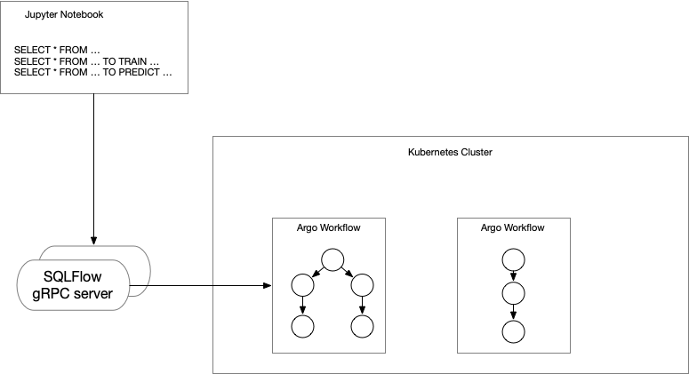

# Running SQLFlow as Workflow Mode

This tutorial introduces how to setup the SQLFlow with workflow mode, you can

1. Find why SQLFlow needs Workflow from [workflow](/doc/design/workflow.md); and
1. How we implement it from [workflow package](/doc/design/workflow_package.md).

The following figure shows a typical SQLFlow workflow architecture:



1. Users type in the SQL program on the client side, like Jupyter Notebook. the SQLFlow plugin on Notebook can send the SQL program to SQLFlow server via gRPC.
1. SQLFlow gRPC server would access the gRPC request and translate it to Workflow YAML file, then submit to Kubernetes.
1. Each of the circle from the above figure represents a workflow step, the workflow engine like Argo would execute them according to the dependency in YAML spec.

## Prerequisites

1. Install [Minikube](https://kubernetes.io/docs/tasks/tools/install-minikube/).
1. Start Minikube

   ```bash
   minikube start --cpus 2 --memory 4000
   ```

1. Install Argo controller and Argo UI.

    ``` bash
    > kubectl crete namespace argo
    > kubectl apply -n argo -f https://raw.githubusercontent.com/argoproj/argo/stable/manifests/install.yaml

1. Forward the Argo UI to the host

    ``` bash
    > kubectl -n argo port-forward deployment/argo-server 2746:2746
    ```

1. Run MySQL Pod with populating the sample dataset.

    ``` bash
    kubectl run mysql --port 3306 --env="SQLFLOW_MYSQL_HOST=0.0.0.0" --env="SQLFLOW_MYSQL_PORT=3306" --image=sqlflow/sqlflow --command -- bash /start.sh mysql
    ```

## Launch SQLFlow server Container

``` bash
> docker run --rm -it --name sqlflow sqlflow/sqlflow bash
> SQLFLOW_WORKFLOW_LOGVIEW_ENDPOINT=http://localhost:8001 sqlflowserver --argo-mode=true
```

`SQLFLOW_WORKFLOW_LOGVIEW_ENDPOINT` specify the Argo UI endpoint which can be used to assemble the step log url.

if you want to using a step Docker image with a fixed tag, the env `SQLFLOW_WORKFLOW_STEP_IMAGE` is helpful, for example:

``` bash
export SQLFLOW_WORKFLOW_STEP_IMAGE=sqlflow/sqlflow:odps_parser
```

## Launch Notebook Server and Run SQLFlow SQL

Run `docker exec` to exec into the `sqlflow` container and launch Jupyter Notebook server:

``` bash
docker exec -it sqlflow bash
SQLFLOW_MYSQL_HOST=172.17.0.9 SQLFLOW_MYSQL_PORT=3306 bash /start.sh sqlflow-notebook
```

`SQLFLOW_MYSQL_HOST` is the IP of MySQL Pod, you can check it out by `kubectl get pod -l run=mysql -o jsonpath="{.items[0].metadata.name}"`

Open browser and goto `http://localhost:8888`, create a new Python3 Kerenel and type in an example SQL program which contains as follows:

``` sql
%%sqlflow
SELECT * FROM iris.train
TO TRAIN DNNClassifier WITH
  model.hidden_units=[10,10],
  model.n_classes=3
LABEL class
INTO sqlflow_models.my_dnn_model;

SELECT * FROM iris.test
TO PREDICT iris.predict.class
USING sqlflow_models.my_dnn_model;
```

You can see the step logs on the Notebook Cell response like the figure as follows:


And you can jumpy to the step log viewer by clicking the step log url:


