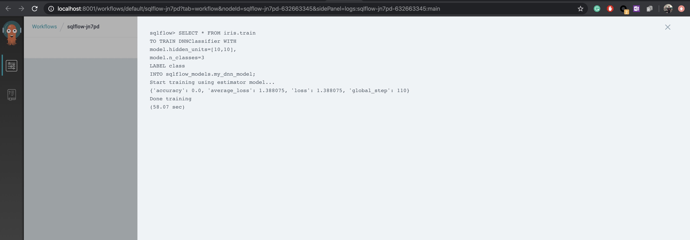

# Running SQLFlow server as Workflow Mode

This tutorial explains how to configure the SQLFLow server to translate SQL programs into workflows.
For what is a workflow and why we need it, please refer to [here](/doc/design/workflow.md).
For the workflow package of SQLFLow that interact with the workflow execution engine, please refer to [here](/doc/design/workflow_pacakge.md)

For a typical workload, users usually type in a SQL program in a GUI system like Jupyter Notebook. The SQLFlow magic command would send the the SQL
program to SQLFlow server via gRPC. The SQLFlow gRPC server accepts a SQL program as the request and translate into a workflow.
Some steps of the workflow send normal SQL statement to the database system, and some others might submit an AI job to train a model, to predict using a trained model or to visually explain a trained model.

## A Step-by-step Guide

As the following step-by-step guide, you can setup the requirements components e.g. a mini Kubernetes cluster(minikube), SQLFlow server and Jupyter Notebook
on you laptop. For the last step, you can run a SQL program in a Jupyter Notebook.

### Setup Kubernetes and Argo

1. Install [Minikube](https://kubernetes.io/docs/tasks/tools/install-minikube/)
1. Setup Minikube

   ```bash
   minikube start --cpus 2 --memory 4000
   ```

1. Install Argo controller and Argo UI.

    ``` bash
    kubectl crete namespace argo
    kubectl apply -n argo -f https://raw.githubusercontent.com/argoproj/argo/stable/manifests/install.yaml
    ```

1. Forward the port of Argo UI server to the host

    ``` bash
    kubectl -n argo port-forward deployment/argo-server 2746:2746
    ```

### Launch SQLFlow server

``` bash
docker run --rm -it --name sqlflow sqlflow/sqlflow bash
SQLFLOW_WORKFLOW_LOGVIEW_ENDPOINT=http://localhost:8001 sqlflowserver --argo-mode=true
```

`SQLFLOW_WORKFLOW_LOGVIEW_ENDPOINT` specify the Argo UI endpoint which can be used to assemble the step log url.

### Launch a MySQL server on Kubernetes

The SQLFLow all-in-one Docker image packaged the MySQL server and [sample datasets](/doc/datasets), you can launch a MySQL server on Kubernetes
with populating the sample datasets as the following command:

``` bash
kubectl run mysql --port 3306 --env="SQLFLOW_MYSQL_HOST=0.0.0.0" --env="SQLFLOW_MYSQL_PORT=3306" --image=sqlflow/sqlflow --command -- bash /start.sh mysql
```

### Launch Jupyter Notebook Server and Run SQLFlow SQL

Run `docker exec` to exec into the `sqlflow` container and launch Jupyter Notebook server:

``` bash
docker exec -it sqlflow bash
SQLFLOW_MYSQL_HOST=172.17.0.9 SQLFLOW_MYSQL_PORT=3306 bash /start.sh sqlflow-notebook
```

`SQLFLOW_MYSQL_HOST` is the Pod IP of MySQL, you can check it out by `kubectl get pod -l run=mysql -o jsonpath="{.items[0].metadata.name}"`

Open browser and goto `http://localhost:8888`, create a new Python3 Kerenel and type in the following SQL program:

``` sql
%%sqlflow
SELECT * FROM iris.train
TO TRAIN DNNClassifier WITH
  model.hidden_units=[10,10],
  model.n_classes=3
LABEL class
INTO sqlflow_models.my_dnn_model;

SELECT * FROM iris.test
TO PREDICT iris.predict.class
USING sqlflow_models.my_dnn_model;
```

Then You would see the step logs like the following screen-cap:


If you want to take a look at the detailed logs of step, you can click the Step Log link to jump to the log viewer webpage:


