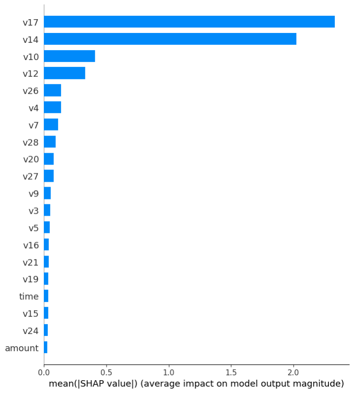
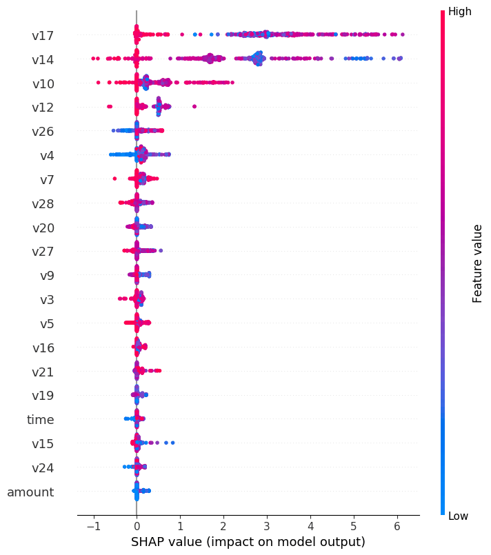
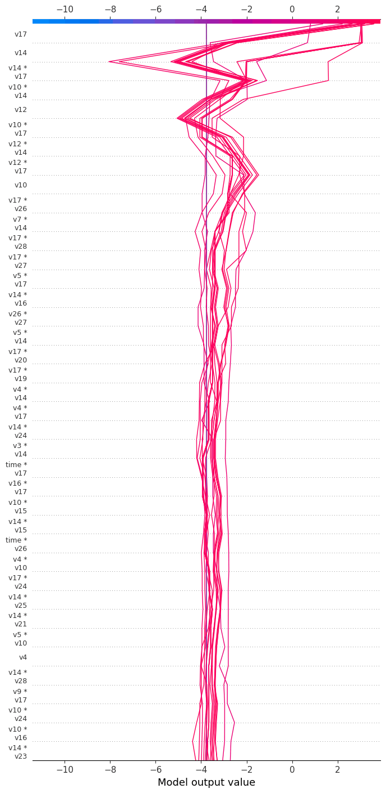

# 信用卡欺诈检测

本教程以信用卡欺诈数据集为例，演示如何使用SQLFlow完成分类任务。

## SQLFlow 环境搭建
请根据您的使用习惯参考 [SQLFlow 命令行工具使用手册](../run/cli.md) 或 [SQLFlow Jupyter Notebook 使用手册](../run/docker.md) 来创建相应的实验环境。

## 数据集简介

对银行来说，能够识别欺诈性的信用卡交易是至关重要的，它可以帮助客户避免不必要的经济损失。
[Kaggle信用卡欺诈数据集](https://www.kaggle.com/mlg-ulb/creditcardfraud)包含2013年9月欧洲持卡人通过信用卡进行的交易。此数据集显示两天内发生的交易，在284807笔交易中，共有492笔盗刷。数据集高度不平衡，正例（发生盗刷）占所有交易的0.172%，这要比常见的点击率预估数据集中正例所占的比例（一般在1%左右）还要低。
在这份数据集中，几乎所有特征都是PCA变换之后的数值。因为信用卡的真实数据涉及用户隐私，一般来说都是公司或银行的高度机密，所以该数据集并未提供原始特征和更多有关数据的背景信息。特征V1、V2……V28是通过PCA得到的主成分，只有time和amount两个特征没有被PCA转化。特征time表示每笔交易与数据集中第一笔交易之间经过的时长（以秒为单位）。特征amount是交易金额，此特征可用于设置样本权重。字段class是标签，如果存在盗刷，则该字段值为1，否则为0。

### 导入到MySQL
#### 下载
Kaggle信用卡欺诈数据集在Kaggle网站上以[压缩包](https://www.kaggle.com/mlg-ulb/creditcardfraud/download)形式提供，需要注册方能下载。下载完成后通过以下命令解压，压缩包中只有一个文件`creditcard.csv`。
```bash
unzip creditcard.csv.zip
```

#### 建表
我们在SQLFlow command-line上用以下语句建立数据表：
```sql
CREATE DATABASE IF NOT EXISTS example;

USE example;

CREATE TABLE IF NOT EXISTS fraud_detection(
    time DOUBLE,v1 DOUBLE,v2 DOUBLE,v3 DOUBLE,
    v4 DOUBLE,v5 DOUBLE,v6 DOUBLE,v7 DOUBLE,
    v8 DOUBLE,v9 DOUBLE,v10 DOUBLE,v11 DOUBLE,
    v12 DOUBLE,v13 DOUBLE,v14 DOUBLE,v15 DOUBLE,
    v16 DOUBLE,v17 DOUBLE,v18 DOUBLE,v19 DOUBLE,
    v20 DOUBLE,v21 DOUBLE,v22 DOUBLE,v23 DOUBLE,
    v24 DOUBLE,v25 DOUBLE,v26 DOUBLE,v27 DOUBLE,
    v28 DOUBLE,amount DOUBLE, class int);
```

#### 导入CSV
建表完成后，将creditcard.csv的内容导入数据表。
```sql
LOAD DATA INFILE 'creditcard.csv'
INTO TABLE fraud_detection CHARACTER SET 'utf8'
FIELDS TERMINATED BY ',' OPTIONALLY ENCLOSED BY '\"';
```

#### 拆分训练和验证数据集
我们按照8:2的比例将数据拆分成训练集和验证集，分别存储在fraud_train，fraud_validate表中。
```sql
select floor(count(*) * 0.8) from fraud_detection;
```
```
+----------------+
| COUNT(*) * 0.8 |
+----------------+
|       227845   |
+----------------+
```
```sql
CREATE TABLE fraud_train AS SELECT * FROM fraud_detection LIMIT 227845;

CREATE TABLE fraud_validate AS SELECT * FROM fraud_detection LIMIT 100000 OFFSET 227845;
```

## 训练
导入数据后，可以通过标准SQL查看各字段的信息，其中time和amount两个字段的取值范围较大，如果用于DNN训练，需要做归一化处理，下文将简单介绍如何进行归一化。而V1、V2...V28都是通过PCA生成，取值范围相对较小，可以直接使用，当然，如果能够对V2...V28也通过归一化处理，对模型效果会有益，读者可以自行练习，在此不做赘述。

### 归一化
数据归一化的方法有很多种，在这个教程中，我们以最大/最小归一化为例。
首先通过以下语句查看amount和time字段的最大最小值：
```sql
SELECT MIN(amount),  MAX(amount), MIN(time), 
   MAX(time) FROM fraud_detection;
```
结果如下：
```
+-------------+-------------+-----------+-----------+
| MIN(AMOUNT) | MAX(AMOUNT) | MIN(TIME) | MAX(TIME) |
+-------------+-------------+-----------+-----------+
|           0 |    25691.16 |         0 |    172792 |
+-------------+-------------+-----------+-----------+
```

获取到最值之后，发现最小值为0，所以在查询数据时，可以通过如下语句将相应字段的数值压缩到0和1之间：
```sql
SELECT 
time / 172792 AS time, amount/25691.16 AS amount 
FROM fraud_detection LIMIT 10;
```

当然也可以使用复杂查询合并这两条语句

```sql
SELECT time / (SELECT MAX(time) FROM fraud_detection) AS time,
       amount/(SELECT MAX(time) FROM fraud_detection) AS amount 
FROM fraud_detection LIMIT 10;
```

### 训练DNNClassifier

执行如下语句

```sql
SELECT amount/25691.16 amount, 
    v1, v2, v3, v4, v5, v6, v7, v8, v9, v10, v11, v12, v13, v14, v15, 
    v16, v17, v18, v19, v20, v21, v22, v23, v24, v25, v26, v27, v28, class FROM fraud_train
TO TRAIN DNNClassifier
WITH train.batch_size=2048,
    model.batch_norm=True,
    model.hidden_units=[200, 100, 50],
    optimizer.learning_rate=0.1,
    validation.select="select * from fraud_validate"
LABEL class
INTO example.my_fraud_dnn_model;
```

### 语法简介
在SQLFlow中，SQL语句以标准SQL中的`SELECT`开始，以`TO`为界，`TO`之后就是SQLFlow的扩展SQL语法。在上面的例子中，`TO TRAIN`表示这是一条训练语句，`DNNClassifier`表示我们使用TensorFlow canned estimators中的`DNNClassifier`来针对信用卡欺诈检测数据集进行模型训练。
`LABEL`关键字指定标签字段为class。
`INTO`关键字指定最终构建的模型的名称，同时也是模块存储的表名，这里指定的是my_fraud_dnn_model。训练完成之后我们可以在该表中查询到以Base64格式保存的模型数据。

#### WITH子句
`WITH`子句用于指定模型参数，在上面的例子中，我们指定了五个参数，分别介绍如下：
##### model.n_classes
该参数指定`DNNClassifier`这样的分类模型的类目数量，由于信用卡欺诈数据集的标签class只有盗刷/正常两种情况，所以我们指定类目数量为2。
实际上，2是`DNNClassifier`默认的类目数量，因此例子中的`model.n_classes=2,`是可以省略的。
##### model.hidden_units
该参数指定`DNNClassifier`中神经网络的结构，[200, 100, 50]表示这个`DNNClassifier`具有三个隐藏神经元层，各层的节点数分别为200、100和50。
##### model.batch_norm
该参数设置为True的话，`DNNClassifier`中神经网络的每个隐藏层后会增加一个batch normalization层，上文中提过，V1、V2…V28取值范围较小，但仍然远大于[-1, 1]这个范围，既然我们没有针对数据本身做归一化，则开启batch normalization对效果和训练的稳定性会有很大帮助。
##### train.batch_size
该参数指定`DNNClassifier`训练的batch大小，神经网络一般都采用随机梯度下降算法，每从数据中读取一个batch的大小，就更新一次模型，前面提到，信用卡欺诈数据集的正负例很不均衡，这个参数需要设置得较大，以此来保障每个batch在概率上至少有一条正例，从而保证训练过程能正常执行。
通过对负例进行采样可以在一定程度上解决正负例不均衡的问题，我们把这个练习留给读者。
##### optimizer.learning_rate
optimizer指定TensorFlow的随机梯度下降算法类别，对DNN来说，一般默认为`Adagrad`算法，learning_rate控制算法的学习率，大部分情况下，这是DNN中最重要的超参数。一般来说，较大的batch_size和batch normalization都有助于设置更大的learning_rate。
AdaGrad的默认学习率为0.001。从理论上讲，AdaGrad的学习率应该尽可能的大，但不能太大。实际上，可以将学习率逐步调大来尝试得到更好的性能。在这个例子中，为了讲述方便，我们并不遵循这个原则，而是把学习率直接提高100倍。

### 模型效果指标
输入语句后，经过几分钟的计算，SQLFlow将输出如下结果：
```
{'accuracy': 0.9984961, 'accuracy_baseline': 0.998081, 'auc': 0.92496324, 'auc_precision_recall': 0.7168096, 'average_loss': 0.0079952, 'label/mean': 0.0019189453, 'loss': 0.0079952, 'precision': 0.8695652, 'prediction/mean': 0.003811173, 'recall': 0.2544529, 'global_step': 140}
```
这些指标看起来会比较复杂，一般来说，二分类问题我们主要关注'auc'、'average_loss'这两个指标，它们分别是0.92496324和0.0079952。

### 训练BoostedTreesClassifier
除深度神经网络之外，SQLFlow还支持两种树模型，即`BoostedTreesClassifier`和`XGBoost`。二者的主要区别在于，`BoostedTreesClassifier`基于TensorFlow，对分布式训练支持得更好，适用于大数据集；而`XGBoost`的解释能力更胜一筹。本节主要介绍`BoostedTreesClassifier`，`XGBoost`将在后文简略介绍。
相比深度神经网络，树模型的优势在于训练快，可解释性更强。此外树模型不依赖数值范围，因此几乎不需要对特征做归一化。在信用卡欺诈检测数据集上，体现为训练语句更加简洁。

使用如下语句训练`BoostedTreesClassifier`
```sql
SELECT * FROM fraud_detection
TO TRAIN BoostedTreesClassifier
WITH 
  train.batch_size=2048,
  model.n_batches_per_layer=140, 
  model.center_bias=True,
  train.epoch=15,
  validation.select="select * from fraud_validate"
LABEL class
INTO example.my_fraud_xgb_model;
```

因为同是TensorFlow的canned estimators，在这条语句中，`WITH`子句指定的参数和`DNNClassifier`类似
##### train.batch_size
为了支持大规模分布式计算，BoostedTreesClassifier和`DNNClassifier`一样，采用分批训练的实现方式，而不是像XGBoost等实现方式一样把所有数据加载到内存中。本参数指定每批数据的大小。
##### model.n_batches_per_layer
由于上述`BoostedTreesClassifier`实现方式的特点，需要为`BoostedTreesClassifier`指定树模型新建层时的统计阈值，由于数据集较小且不均衡，本例指定为全量数据。
##### model.center_bias
指定为True时，模型将尝试把预估值拉到正例量/数据量附近，训练会更慢，但结果中预估值将更加准确。如果要解释BoostedTreesClassifier模型，必须指定该参数为True。
##### train.epoch
指定模型训练轮数，由于我们指定了model.center_bias，需要更长时间的训练才能得到较为理想的效果，所以在此设为15轮。

输入语句后，经过近30分钟的计算，SQLFlow将输出如下结果：
```
{'accuracy': 0.99905, 'accuracy_baseline': 0.998075, 'auc': 0.9250706, 'auc_precision_recall': 0.6146745, 'average_loss': 0.010417772、, 'label/mean': 0.001925, 'loss': 0.0104177715, 'precision': 0.72517323, 'prediction/mean': 0.0073437695, 'recall': 0.8155844, 'global_step': 2005}
```

### 训练线性模型
和训练`DNN`类似，使用如下语句训练逻辑回归模型
```sql
SELECT amount/25691.16 amount, 
  v1, v2, v3, v4, v5, v6, v7, v8, v9, v10, v11, v12, v13, v14, v15, 
  v16, v17, v18, v19, v20, v21, v22, v23, v24, v25, v26, v27, v28, class 
FROM fraud_detection
TO TRAIN LinearClassifier
WITH
  train.batch_size=2048,
  optimizer.learning_rate=0.01,
  validation.select="select * from fraud_validate"
LABEL class
INTO fraud_lr_model;
```

线性模型没有隐层结构，因此不用指定`model.hidden_units`和`model.batch_norm`这两个参数。输入语句后，经过几分钟的计算，SQLFlow将输出如下结果：
```
{'accuracy': 0.9986084, 'accuracy_baseline': 0.998081, 'auc': 0.9482663, 'auc_precision_recall': 0.7051881, 'average_loss': 0.53609824, 'label/mean': 0.0019189453, 'loss': 0.53609824, 'precision': 0.6034483, 'prediction/mean': 0.41507623, 'recall': 0.8015267, 'global_step': 140}
```

### 训练AutoClassifier
如何设计`DNN`的结构？是选择线性模型还是神经网络模型？如果没有精力研究此类问题，您可以尝试使用SQLFlow提供的自动分类器`AutoClassifier`，它会找出适合数据集的最佳结构。使用如下语句训练`AutoClassifier`模型：

```sql
SELECT amount/25691.16 amount, 
  v1, v2, v3, v4, v5, v6, v7, v8, v9, v10, v11, v12, v13, v14, v15, 
  v16, v17, v18, v19, v20, v21, v22, v23, v24, v25, v26, v27, v28, class
FROM fraud_detection
TO TRAIN sqlflow_models.AutoClassifier
WITH
  train.batch_size=2048,
  validation.select="select * from fraud_validate"
LABEL class
INTO example.my_fraud_auto_model;
```

输入语句后，经过一段时间的计算，SQLFlow将输出如下结果：
```
'accuracy': 0.998081, 'accuracy_baseline': 0.998081, 'auc': 0.93193114, 'auc_precision_recall': 0.6916478, 'average_loss': 0.0063595325, 'best_ensemble_index_0': 1, 'iteration': 0, 'label/mean': 0.0019189453, 'loss': 0.0063595325, 'precision': 0.0, 'prediction/mean': 0.0026214072, 'recall': 0.0, 'global_step': 140}
```
`AutoClassifier`的优势在于不需要用户指定太多参数，也不用手动调优，就可以得到还不错的效果，缺点是效果可能不及花时间手动调优，另外运行性能也会慢一些。

### 训练XGBoost
类似地，使用如下语句训练`XGBoost`模型
```sql
SELECT * FROM fraud_train
TO TRAIN xgboost.gbtree WITH
	objective=binary:logistic,
	eval_metric=auc,
  validation.select="select * from fraud_validate"
LABEL class
INTO example.my_fraud_xgb_model;
```

和`BoostedTreesClassifier`类似，训练语句比较简洁，这是因为我们使用的是树模型`xgboost.gbtree`，不依赖数值范围，因此不需要归一化。
输入语句后，经过几分钟的计算，SQLFlow将输出如下结果：
```
Evaluation result: {'train': {'auc': [0.918589, 0.918598, 0.922635, 0.922636, 0.922639, 0.92264, 0.923647, 0.924651, 0.951992, 0.952153]}, 'validate': {'auc': [0.918589, 0.918598, 0.922635, 0.922636, 0.922639, 0.92264, 0.923647, 0.924651, 0.951992, 0.952153]}}}
```

### 模型效果对比
Kaggle 官方论坛上也有不少用户公布了其模型的效果，`AUC` 主要集中在 0.93 至 0.96 之间，和我们刚才在SQLFlow中尝试的各个模型获得的结果基本相当。您可以从特征、模型、调优这几方面着手来尝试改进本文中已经获得的效果。作为练习。

### 小结
在这一节，我们
1. 了解了SQLFlow的训练语法，包括`TO TRAIN`子句、`WITH`子句、`LABEL`和`INTO`
2. 熟悉了`DNNClassifier`和`model.n_classes`、`model.hidden_units`、`train.batch_size`和`optimizer.learning_rate`这几个重要的参数
3. 熟悉了`BoostedTreesClassifier`和`model.n_batches_per_layer`、`model.center_bias`、`train.epoch`等重要参数
4. 熟悉了如何训练`DNN`、逻辑回归、`XGBoost`等模型

## 解释
在处理实际问题的时候，并不是用机器学习技术训练出一个效果良好的模型，预测出结果就万事大吉。我们经常需要分析模型学到了什么，以确定模型是如何决策的，模型的预测结果是不是合理的，等等。
在训练信用卡欺诈模型的过程中，我们掌握了多种模型，但仍然缺乏对数据的真正理解。当然，通过SQL语句来分析预测结果，确实也能作出合理的解释，但是SQLFlow提供了更强大的模型分析能力，可以帮助用户方便地洞察模型和数据。SQLFlow目前为`XGBoost`提供柱状图、散点图和决策图三种模型解释方法，为DNN和线性模型提供柱状图和散点图两种模型解释方法，为`BoostedTrees`模型提供柱状图和提琴图两种模型解释方法。以下以`XGBoost`为例，展示SQLFlow的分析能力。
### 柱状图分析
```sql
SELECT * FROM fraud_detection WHERE class=1
TO EXPLAIN example.my_fraud_xgb_model WITH summary.plot_type=bar;
```
在这条SQL语句里，`TO EXPLAIN`表示这是一条模型解释语句，`TO`之前的部分表示我们要通fraud_train中的所有正例（发生盗刷）来解释模型。之所以只选取正例，是因为信用卡欺诈检测的正负例极不均衡，对模型而言，正例的影响要比负例大得多，而如果选取较多负例，可能导致绘图时正例的数据被淹没。当然，如果使用正负例比较均衡的数据集，可以均匀选取正负例。
和预测语句类似，`EXPLAIN`之后的部分指定需要解释的机器学习模型所存放的位置，这里我们指定了刚才训练好的`XGBoost`模型`my_fraud_xgb_model`。
在`EXPLAIN`语句中，通过`WITH`子句可以指定图表类型，这里我们指定绘制柱状图。
运行这条语句大概会花几分钟的时间，运行结束后，界面上会打印出分析图表的链接（如果您使用iTerm2，或者Jupyter Notebook，图形将直接呈现在相应界面上），如下图：



这个柱状图根据信用卡欺诈数据集中的全部正例，按重要程度从高到低，列出各个特征对判断盗刷与否的重要程度。由于信用卡欺诈数据集对主要特征都通过PCA处理，我们只能看出哪些特征影响更大，无法做出具体解释。

#### 散点图分析
通过柱状图可以清晰地看到哪些特征更重要，但还无法告诉我们到底这些重要的特征是如何影响模型判断的。除柱状图外，SQLFlow还支持为模型绘制散点图，通过散点图，我们就能看到各特征的正面或负面影响。
在`EXPLAIN`语句中，通过`WITH`子句可以指定图表类型：
```sql
SELECT * FROM fraud_detection WHERE class=1
TO EXPLAIN example.my_fraud_xgb_model WITH summary.plot_type=dot;
```
这条语句的最终输出结果如下图：


以V26和V14为例，从散点图显示的情况来看，在V26的取值较大时（红色），[SHAP value](https://github.com/slundberg/shap)较高，也就是说该笔交易为盗刷的可能性较高；同理，V14取值较小时（蓝色），该笔交易为盗刷的可能性较高。
#### 决策图分析
决策图只适用于`XGBoost`模型，它主要解决两个问题：
1. 展示树模型是如何根据样本特征得到最终的预估值的。
2. 展示特征之间交叉组合的影响。
举例来说，我们想看到模型对20条盗刷正例的预测情况，可通过以下`EXPLAIN`语句来绘制决策图。
```sql
SELECT * FROM fraud_detection 
WHERE class=1 LIMIT 20
TO EXPLAIN my_fraud_xgb_model 
WITH summary.plot_type=decision;
```
这条语句的最终输出结果如下图：

从决策图中可以看到各特征及其二元组合在对输出结果的重要程度，在这个例子中，我们可以看到刚才训练的模型对这20条正例都给出了正确（红线）的预估值，同时可以看到每条样本是如何从底部开始，逐步经过各特征的影响，到达最终的预估值，如V14拉低预估值，而V17拉高预估值。
决策图也可以用来调试模型，如查看某一样本预测错误的原因等。

# 总结
在这篇文章中，我们介绍了Kaggle信用卡欺诈数据集，接着，我们以`DNNClassifier`、`LinearClassifier`和`XGBoost`等为例，介绍了如何使用SQLFlow来完成机器学习的主要任务：
1. 训练：如何根据数据构建模型
- `SELECT ... TO TRAIN`语法
2. 调参：如何设置不同模型的不同参数：
- `WITH`子句用于设置训练参数
- `model.hidden_units`参数用于控制DNN模型的结构
- `optimizer.learning_rate`参数用于控制DNN模型的学习速率
- `model.n_batches_per_layer`参数用于控制TensorFlow树模型的层更新阈值
- `model.center_bias`参数用于将TensorFlow树模型的预估值拉到平均值附近
- `train.batch_size`参数用于控制模型批次使用数据时的分批大小
- `train.epoch`参数用于控制模型的训练轮数
3. 预测：在新数据集上应用训练好的模型
- `SELECT ... TO PREDICT`语法
4. 解释
- `SELECT ... TO EXPLAIN`语法
- 柱状图告诉我们模型中哪些特征较为重要
- 散点图告诉我们这些特征对结果的影响是正面还是负面
- 决策图帮助我们了解组合特征对模型的影响，以及模型决策的过程。
了解了这些知识，您就可以在日常工作或学习中应用SQLFlow来解决问题。需要补充的是，除了文中提到的模型之外，SQLFlow还支持很多别的模型，它们适用于各种不同的问题，请参考SQLFlow的[模型文档](model_list.cn.md)来了解这些信息。
