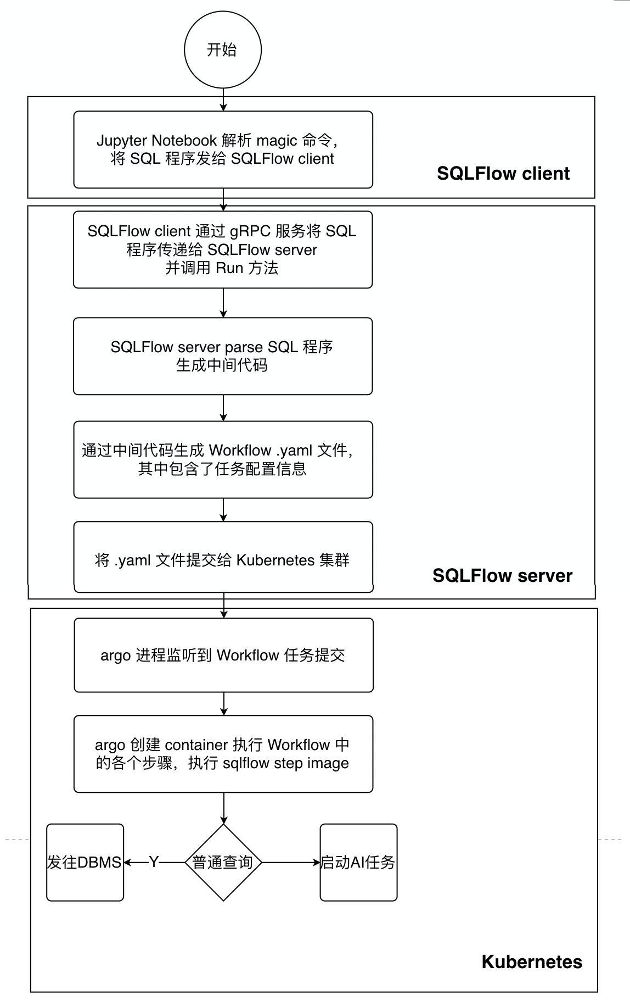

# SQLFlow 开发入门指引

本文从初学者的视角来讲对于 SQLFlow 理解和认识。文章由浅入深分为几个部分：首先我们介绍 SQLFlow 解决的问题，通过简单的分析让读者理解系统的主要功能。随后我们将快速体验 SQLFlow 功能并分析其部署和运行方式。在此之后将为读者简单介绍向 SQLFlow 贡献代码的流程。最后将更加深入的介绍 SQLFlow 的代码结构，帮助读者快速进入到开发实战中。

## SQLFlow 解决什么问题
一句话来讲，SQLFlow 是一个翻译器，它将 SQL 程序翻译成为分布式机器学习任务的配置文件，然后将任务提交到机器学习集群中去执行。

具体来说，我们定义了[扩展的 SQL 语法](https://github.com/sql-machine-learning/sqlflow/blob/develop/doc/language_guide.md)，用户可以通过这套语法来描述机器学习中的训练、预测、解释等任务。SQLFlow 通过解析这些 SQL 程序，将机器学习任务的执行拆分成若干步骤，这些步骤组成了一个个工作流（workflow）并会以`.yaml`文件的形式进行输出。SQLFlow 将这些文件提交到 Kubernetes 集群上去执行并获取执行结果。

这里只是一个很粗略的描述，下一节中我们将通过一个例子来讲解 SQLFlow 的运行流程。

## SQLFlow 如何部署和运行
SQLFlow 系统由客户端和服务端组成。客户端包括[命令行工具](https://github.com/sql-machine-learning/sqlflow/blob/develop/doc/run/cli.md)和[Jupyter Notebook](https://github.com/sql-machine-learning/sqlflow/blob/develop/doc/quick_start.md)等形式，而服务端是一个 SQLFlow Server，他们通过 gRPC 服务进行连接。之所以设计一个服务端，是为了满足多租户的需求，同时也为了方便与其他计算资源结合（比如将 SQLFlow Server 部署到生产环境的计算集群中，这些集群通常是客户端无法直接访问的）。

接下来我们将在本地用创建一个 SQLFlow 开发环境，并通过一个例子介绍 SQLFlow 的运行流程。在此之前我们需要以下预备知识，以下做简要的介绍：
- [Docker](https://www.docker.com/)
- [Kubernetes](https://kubernetes.io/)
- [Argo Workflows](https://argoproj.github.io/)
- [gRPC](https://www.grpc.io/)

### Docker
Docker 是一个轻量的虚拟化容器系统，它可以帮助我们创建一个隔离于宿主系统的运行环境，这对于在同一台物理机上自动化部署多个应用非常重要。Docker 应用通常以 Docker Image 的形式进行发布，它包含了应用本身及其所需的所有依赖，如源代码、运行时环境、系统工具、配置文件等等。可以参考[安装文档](https://docs.docker.com/get-docker/)进行安装。[这里](https://docs.docker.com/get-started/overview/)介绍了 Docker 系统中的 Image、Container、Volume等重要概念。

### Kubernetes
Kubernetes 是一个开源的集群管理工具，它可以帮助我们完成自动部署，容量伸缩，容器生命周期管理等工作。Kubernetes 系统中包含很多概念，可以从[这里](https://kubernetes.io/docs/concepts/)进行了解。Kubernetes 通常采用 Docker 作为容器部署应用，下面这幅图来自[官方文档](https://kubernetes.io/docs/tutorials/kubernetes-basics/create-cluster/cluster-intro/)能够说明系统中各个概念的关系。


### Argo Workflows
Argo Workflows 是一个工作流引擎，它对工作流中的各个步骤进行依赖分析和编排，然后为每个步骤启动一个 Docker 容器并指定运行的 Image 及其它配置。此后 Argo Workflows 将监控这些步骤的运行，它甚至提供了一个 web 界面来方便用户查看任务运行情况。从[这里](https://argoproj.github.io/docs/argo/readme.html)可以查看更多文档内容。有趣的是 Argo Workflows 本身也是在容器中运行的。

### gRPC
gRPC是一个高性能的 RPC 框架。gRPC 使用 [Protocol Buffers](https://developers.google.com/protocol-buffers) 定义数据结构和服务，从而可以轻松实现跨语言跨平台的通信。

### 开发环境搭建
这里我们使用 minikube 搭建 Kubernetes 环境，并且在 Kubernetes 中部署 Argo Workflows，然后在 Docker 中部署 SQLFlow server 并通过 Jupyter Notebook 工具进行查询。我们在 macOS 上进行操作，其他操作系统方式可能稍有不同，请参考官方文档。
1. 下载并安装 minikube 
    ```bash
    brew install kubernetes-cli minikube
    ```
1. 根据[官方文档](https://www.virtualbox.org/)进行安装 VirtualBox。

1. 使用 minikube 启动 Kubernetes 集群，这个集群只有一个节点。通过 dashboard 查看集群运行情况，运行 dashboard 命令后会在浏览器中自动打开其界面
    ```bash
    minikube start --vm-driver=virtualbox
    nohup minikube dashboard &
    ```
1. 下载 SQLFlow 代码
    ```bash
    git clone https://github.com/sql-machine-learning/sqlflow.git sqlflow
    cd sqlflow
    ```
1. 通过代码中的脚本启动 Argo Workflow 服务
    ```bash
    scripts/travis/start_argo.sh
    ```
1. 运行 SQLFlow server (待补全，现有的start.sh中不是Workflow方式运行的，需要参考 ci 中的 Workflow 运行方式)
    ```bash
    docker pull sqlflow/sqlflow:ci
    docker run -rm -it -p8888:8888 --name=sqlflow -v$(pwd):/sqlflow -w /sqlflow sqlflow/sqlflow:ci bash /start.sh all
    ```
1. 打开 Jupyter Notebook 并运行 SQL，稍后会在页面上打印出iris.train 表中的前10条数据。
    ```
    %%sqlfow
    select * from iris.train limit 10;
    ```

### 运行流程分析
当我们在 Jupyter Notebook 中输入一段 SQL 程序之后发生了什么呢？下图展示了主要的流程：首先，用户在 Jupyter 上使用 magic 命令 %%sqlflow，然后输入 SQL 程序，这段程序会被 SQLFlow gRPC client发送到 SQLFlow server 上。server 解析 SQL 程序并生成一个 `.yaml` 文件，该文件包含了 Argo Workflow 的定义。将该文件提交到 Kubernetes 集群之后会被 Argo 解析，从而创建出 Container 来执行每一个步骤。在每个具体步骤执行的时候使用的是 SQLFlow 的 step image sqlflow:submitter。这个镜像会执行实际的操作，比如查询数据库或者是提交一个任务给 AI 引擎执行。


## 如何为 SQLFlow 贡献代码
1. 首先你需要一个 [GitHub](https://github.com/) 账号
1. 克隆 [SQLFlow](https://github.com/sql-machine-learning/sqlflow) repo 到你的账号中，你将会在自己的账号中看到相应的repo，比如：https://github.com/lhw362950217/sqlflow
1. 将克隆的 repo 下载到本地 git clone https://github.com/lhw362950217/sqlflow sqlflow
1. 提 issue 描述你要想实现的特性或报告 BUG ，并指定解决人
1. 如果你计划实现某个功能，你需要首先撰写一个[设计文档](https://github.com/sql-machine-learning/sqlflow/tree/develop/doc/design)
1. 将本地写好的设计文档或者代码提交到你克隆的 repo 中
1. 不论是提交设计文档还是代码，都需要经过 code review，因此，你需要创建一个 PR
1. PR 创建后会自动运行 CI build 等检查流程，如果报错需要进行修复
1. 邀请其他开发人员进行 review 并做相应修改
1. 当其他开发人员通过 review 之后，你可以合并代码到 SQLFlow 主 repo 中，这样就完成了一次代码贡献

## SQLFlow 代码结构介绍
下面简单介绍一下 SQLFlow 的代码组织结构
```
sqlflow
├── cmd 各种 binary 文件的入口
├── doc 文档
├── docker 生成 docker image 所需要的脚本
├── java 一些 DB parser，如 hive、maxcompute、calcite 的 parser
├── pkg
    ├── database 数据库的封装，通过这个包来访问数据库
    ├── ir 中间代码，SQLFlow 编译 SQL 生成的中间表示，是代码生成的输入
    ├── model 模型的抽象表示
    ├── parser SQL Parser接口
    ├── proto 数据结构定义及 gRPC 服务定义
    ├── server SQLFlow server 逻辑
    ├── sql 这里包含了执行 SQL 所需的逻辑，比如 SQL 解析，中间代码生成，任务提交等，该库的结构不是特别清晰，需要进行梳理
    ├── sqlfs 将数据库抽象为文件系统，用于存储模型等
    ├── step Workflow 中一个执行步骤的bin
    ├── tablewriter 打印查询结果的工具
    └── workflow Workflow 模型想逻辑
├── python 各种计算平台上的 submitter
├── scripts git-hook、ci、docker build 等脚本

具体看代码的时候可以从 cmd 文件夹入手，这个文件夹中的 sqlflowserver 是 server 的入口，类似的 sqlflow、step分别是命令行工具和 Workflow step 的入口。
```