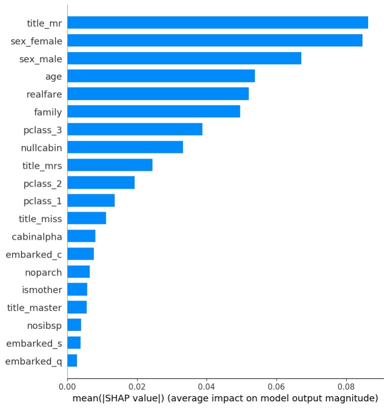
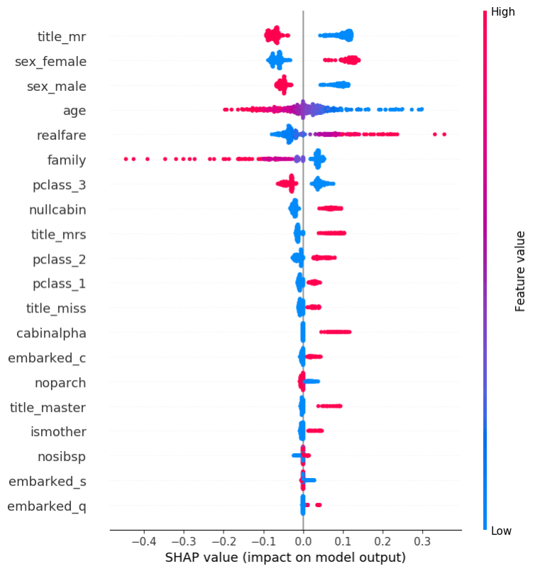

# 泰坦尼克号沉船生存预测

本教程以泰坦尼克号数据集为例，演示如何使用SQLFlow完成分类任务。

## SQLFlow 环境搭建
请根据您的使用习惯参考 [SQLFlow 命令行工具使用手册](../run/cli.md) 或 [SQLFlow Jupyter Notebook 使用手册](../run/docker.md) 来创建相应的实验环境。

## 数据
### 简介
泰坦尼克号沉船发生在1912年，这次事故导致2224名乘员中的1502人遇难。事实证明，乘员能否在这场灾难中幸存，并非完全随机，而是取决于诸多因素，如乘客的舱位、性别、年龄等情况都至关重要。泰坦尼克数据集收集了部分乘客名单，包括了乘客的各种特征及其是否幸存。这是一个典型的二分类问题。将数据导入到数据库中，以乘客特征作为输入，乘客是否幸存作为标签，选定部分数据作为训练数据，再结合SQLFlow提供的机器学习工具集，就可以建立一个二分类机器学习模型，用来预测其余数据(测试数据)中的乘客是否能生存下来。

使用机器学习技术解决这类分类问题，要做的工作就是通过对训练数据的特征与标签进行探索，构建合适的模型加以训练，再用训练好的模型预测测试数据中特征对应的标签。

泰坦尼克号数据集的详细介绍可以参考[kaggle网站对其的介绍](https://www.kaggle.com/c/titanic/data)，部分数据字段可参见下表：

| 名称 | 描述 | 含义 |
| --- | --- | --- |
| survival | 是否幸存 | 0 = 遇难, 1 = 生存 |
| pclass | 票务等级 | 1 = 头等舱, 2 = 二等舱, 3 = 三等舱 |
| sex | 性别 | |
| Age | 年龄 | |
| sibsp | 该乘客在泰坦尼克号上的兄弟姐妹及配偶的人数 | |
| parch | 该乘客在泰坦尼克号上的父母/子女的人数 | |
| ticket | 票号 | |
| fare | 票价 | |
| cabin | 客舱编号 | |
| embarked | 登船港 | C = Cherbourg(瑟堡), Q = Queenstown(皇后镇), S = Southampton(南安普敦) |

### 导入
#### MySQL
对于MySQL用户，可以下载SQLFlow提供的[SQL](https://github.com/sql-machine-learning/sqlflow/blob/develop/doc/datasets/popularize_titanic.sql)程序，通过执行命令将泰坦尼克号数据集导入MySQL。
```sql
$ mysql < popularize_titanic.sql
```

如果您使用SQLFlow命令行工具，也可以直接使用`sqlflow`命令来导入数据：
```bash
$ sqlflow -f popularize_titanic.sql
```
导入完成后，可以在titanic这个MySQL数据库中访问泰坦尼克数据集。titanic.train和titanic.test这两个数据表分别是训练数据和测试数据。

可以通过运行SQL语句来查看数据内容，如
```sql
DESCRIBE titanic.train;
SELECT * FROM titanic.train limit 20;
```

#### Hive
如果您是Hive用户，导入数据的方法与MySQL类似，可能需要根据HiveQL特定的语法及数据类型修改上述SQL文件，修改细节此处略过。修改后通过执行命令将泰坦尼克号数据集导入Hive。
```sql
$ hive -f popularize_titanic_hive.sql
```

### 小结
在这一部分，我们了解了泰坦尼克号数据集以及机器学习普遍使用的术语：分类、特征、标签、训练数据、测试数据。此外，我们也掌握了将训练数据导入给SQLFlow的方法。是的，这和使用常见数据库导入数据的方法完全一致。为避免冗余描述，后续章节中主要以MySQL为例。如果您使用Hive，只需把例子语句中的表名改为Hive对应的表名即可。

## 训练
以MySQL为例，在SQLFlow中，使用以下语句训练模型
```sql
SELECT * FROM titanic.train
TO TRAIN DNNClassifier WITH
  model.n_classes=2,
  model.hidden_units=[100, 100]
LABEL survived
INTO titanic.my_titanic_model;
```

需要注意的是，如果您使用Jupyter Notebook，需要在输入框里先输入SQLFlow magic command并换行，然后再输入SQL语句，即：
```sql
%%sqlflow
SELECT * FROM alifin_jtest_dev.sqlflow_titanic_train
TO TRAIN DNNClassifier WITH
  model.n_classes=2,
  model.hidden_units=[100, 100],
  validation.select='select * from titanic.train'
LABEL survived
INTO my_titanic_model;
```

### 语法简介
在SQLFlow中，SQL语句以标准的`SELECT`开始，以`TO`为界，之后就是SQLFlow的扩展SQL语法。在上面的例子中，`TO TRAIN`表示这是一条训练语句，`DNNClassifier`表示我们使用`TensorFlow Estimator`中的`DNNClassifier`来针对泰坦尼克号数据集进行模型训练。

`LABEL`关键字指定标签字段为`survived`。

`INTO`关键字指定模型存放位置，这里指定的模型存放位置是`titanic`数据库中的`my_titanic_model`数据表。

#### WITH子句
`WITH`子句用于指定模型参数，在上面的例子中，我们指定了`DNNClassifier`的`n_classes`和`hidden_units`两个参数。

##### model.n_classes
该参数指定`DNNClassifier`这样的分类模型的类目数量，由于泰坦尼克号数据集的标为`survived`只有生存/死亡两种情况，所以我们指定类目数量为2。
实际上，2也是`DNNClassifier`默认的类目数量，因此例子中的的`model.n_classes=2`,是可以省略的。

##### model.hidden_units
该参数指定`DNNClassifier`中神经网络的结构，`[100, 100]`表示这个`DNNClassifier`具有两个隐藏神经元层，每层各有100个节点。

##### validation.select
该参数指定训练过程中用于计算评价指标的数据集，这里我们选择全部训练数据。

### 模型效果指标
#### *第一个模型*
输入语句后，经过几分钟的计算，SQLFlow将输出如下结果（您的结果数据可能稍有不同）：
```json
{'accuracy': 0.73, 'accuracy_baseline': 0.59, 'auc': 0.85923934, 'auc_precision_recall': 0.82692003, 'average_loss': 0.574085, 'label/mean': 0.41, 'loss': 0.574085, 'precision': 0.8181818, 'prediction/mean': 0.39607105, 'recall': 0.4390244, 'global_step': 891}
```
这些指标看起来会比较复杂，一般来说，我们主要关注'accuracy'、'auc'、'average_loss'这三个模型性能相关的指标，它们分别是0.73、0.85923934和0.574085。其中'accuracy'和'auc'可以理解为模型分类准确的能力，越高越好；而'average_loss'代表模型和训练数据之间的误差，是越低越好。

### 模型效果调优
对深度神经网络来说，默认参数的性能在大多数情况下并不是最优的，如果需要更好的性能的模型，则需要调整参数来尝试。

#### 结构调整
一般来说，越复杂的DNN模型具有越好的效果，理论上已经证明，具有足够数量隐藏层和神经元的DNN能够拟合任何数据。因此我们的第一个效果改进方案是扩大模型规模，增加网络层数和神经元数量，例如，将模型结构调整为三层，将每层的隐藏单元设为200，如以下语句所示，因为DNNClassifier默认执行二分类，这里不再指定model.n_classes：

```sql
SELECT * FROM titanic.train
TO TRAIN DNNClassifier WITH
  model.hidden_units=[200, 200, 200],
  validation.select='select * from titanic.train'
LABEL survived
INTO titanic.my_titanic_model;
```

#### *第二个模型*
运行上述语句，可得到如下结果：
```json
{'accuracy': 0.77, 'accuracy_baseline': 0.59, 'auc': 0.8648202, 'auc_precision_recall': 0.85405207, 'average_loss': 0.51909953, 'label/mean': 0.41, 'loss': 0.51909953, 'precision': 0.7647059, 'prediction/mean': 0.4111891, 'recall': 0.63414633, 'global_step': 891}
```

可以看到，'accuracy'、'auc'、'average_loss'这三个指标都有不同程度的提升。

#### 参数调整
我们的第二个性能改进方案是加快DNNClassifier的学习速率。这需要在WITH中指定一个新的参数：

**optimizer.learning_rate**

optimizer是TensorFlow的数值优化算法，对DNN来说，一般默认为AdaGrad算法，learning_rate控制数值优化算法的学习率，大部分情况下，这是DNN中最重要的超参数。

AdaGrad的默认学习率为0.001。从理论上讲，AdaGrad的学习率应该尽可能的大，但不能太大。实际上，可以将学习率逐步调大来尝试得到更好的性能。在这个例子中，为了讲述方便，我们并不遵循这个原则，而是把学习率直接提高10倍：

```sql
SELECT * FROM titanic.train
TO TRAIN DNNClassifier WITH
  model.hidden_units=[200, 200, 200],
  optimizer.learning_rate=0.01,
  validation.select='select * from titanic.train'
LABEL survived
INTO titanic.my_titanic_model;
```
#### *第三个模型*

运行上述语句，可得到如下结果：
```json
{'accuracy': 0.81, 'accuracy_baseline': 0.59, 'auc': 0.88776356, 'auc_precision_recall': 0.87235326, 'average_loss': 0.4499029, 'label/mean': 0.41, 'loss': 0.4499029, 'precision': 0.8666667, 'prediction/mean': 0.30435455, 'recall': 0.63414633, 'global_step': 891}
```
可以看到，'accuracy'、'auc'、'average_loss'这三个指标有了大幅的提升。

当然，在训练数据上达到0.81这样的准确率，在泰坦尼克号这个数据集上并不算高，kaggle竞赛中有些模型可以在测试数据上达到0.9左右。

此外，您可以查看kaggle网站上关于该数据集上能达到的最佳性能的讨论来获取更多信息，有兴趣的读者可以在SQLFlow中做更多效果调优的尝试，达到更佳性能，作为练习。

### 小结
在这一节，我们了解了SQLFlow的训练语法，包括`TO TRAIN`子句、`WITH`子句、`LABEL`和`INTO`。熟悉了`DNNClassifier`和`model.n_classes`、`model.hidden_units`和`optimizer.learning_rate`这三个重要的参数，同时也学会了如何通过后二者来提升DNNClassifier的效果。

## 预测

从训练数据得到一个表现良好的模型是重要的一步，在机器学习的实际应用中，我们往往需要把模型应用到新的数据，以发挥它的价值。这是本节要介绍的内容。

仍以MySQL为例，在SQLFlow中，使用以下语句将已有模型应用到泰坦尼克号测试数据上，来预测新数据中乘员的生存情况
```sql
SELECT * FROM titanic.test
TO PREDICT titanic.sqlflow_titanic_predict.survived
USING titanic.my_titanic_model;
```

在这条SQL语句里，TO PREDICT表示这是一条预测语句，TO之前的部分表示我们要预测titanic.test中的全部数据。而我们的预测结果将存放在titanic.predict.survived字段中。

USING关键字指定我们用来预测数据的机器学习模型，上一节的例子中，我们使用INTO关键字指定训练好的DNNClassifier模型存放于titanic数据库中的my_titanic_model数据表，在这里便指定为同样的位置。

运行这条语句大概会花几分钟的时间，您可以利用标准SQL来查看测titanic.predict表中的结果。

## 解释
在处理实际问题的时候，并不是用机器学习技术训练出一个效果良好的模型，预测出结果就万事大吉，我们经常需要分析模型学到了什么，以确定模型是如何决策的，模型的预测结果是不是合理的等等。

对泰坦尼克号这个问题来说，虽然我们已经得到了一个效果不错（AUC和Accuracy都在0.8以上）的模型，但仅仅是预测生存或死亡，仍然缺乏对数据的真正理解。比如说，哪些因素对乘客在灾难中的生死有更大的影响？这个问题在训练和预测过程中都无法回答。这就涉及到如何解释机器学习模型。

当然，通过SQL语句来分析预测结果，确实也能作出合理的解释，但是SQLFlow提供了更强大的模型分析能力，可以帮助用户方便地洞察模型和数据。

### 柱状图分析
```sql
SELECT * FROM titanic.test
TO EXPLAIN titanic.my_titanic_model;
```

在这条SQL语句里，TO EXPLAIN表示这是一条模型解释语句，TO之前的部分表示我们要通过titanic.test中所有数据来解释模型，和预测语句类似，EXPLAIN之后的部分指定需要解释的机器学习模型所存放的位置，这里我们指定了刚才训练好的模型。

运行这条语句大概会花十五分钟左右的时间，如果您使用SQLFlow命令行工具或是Jupyter Notebook，界面上会直接显示图表内容。这条语句的最终输出结果如下图：



这个柱状图根据titanic.test中的全部数据，按重要程度从高到低，列出各个因素对乘客是否生存的影响程度。以性别为例，我们可以从图中看到，乘客的性别对生存与否有很大的影响。

### 散点图分析
通过柱状图可以清晰地看到哪些因素对乘客最终幸存影响最大，而这些影响到底是正面的，还是负面的，就无法看出来了。比如说，男性（sex_male）和女性(sex_female)在上面的柱状图中都很靠前，柱状图只能告诉我们性别对幸存机会影响很大，显然无法告诉我们到底是男性生存率高，还是女性生存率高。

幸运的是，除柱状图外，SQLFlow还支持为DNN模型绘制散点图，通过散点图，我们就能看到各因素的正面或负面影响。

在**EXPLAIN**语句中，通过**WITH**子句可以指定图表类型：
```sql
SELECT * FROM titanic.test
TO EXPLAIN titanic.my_titanic_model WITH summary.plot_type=dot;
```

这条语句的最终输出结果如下图：



以性别为例，从散点图显示的情况来看，在泰坦尼克号发生事故时，女性的生存机会远大于男性，这和电影情节所述一致。如果用以下标准SQL来查看整个数据集，可以得到类似的结论
```sql
SELECT sex_male, survived, count(*) FROM titanic.train GROUP BY sex_male, survived;
```

这条语句输出结果如下：
```
+----------+----------+----------+
| SEX MALE | SURVIVED | COUNT(*) |
+----------+----------+----------+
|        0 |        0 |       81 |
|        0 |        1 |      233 |
|        1 |        0 |      468 |
|        1 |        1 |      109 |
+----------+----------+----------+
```

可见，女性的生存机会确实比男性要高。当然，实际情况要更复杂一些，例如不同港口上船的乘客幸存者中男女比例有很大差异，您可以通过XGBoost模型的决策图来查看更为细致的分析。

## 总结
在这篇文章中，我们首先介绍了泰坦尼克号数据集及机器学习行业普遍使用的术语：分类、特征、标签、训练数据、测试数据。然后我们介绍了如何将数据集导入SQLFlow，这和使用MySQL或Hive等SQL引擎毫无二致。

接着，我们以DNNClassifier为例，介绍了如何使用SQLFlow来完成机器学习的主要任务：
1. 训练：根据数据构建模型
    * SELECT ... TO TRAIN语法
1. 调优：调整神经网络结构和参数提升效果
    * WITH子句用于设置训练参数
    * model.hidden_units参数用于控制DNN模型的结构
    * optimizer.learning_rate参数用于控制模型的学习速率
1. 预测：在新数据集上应用训练好的模型
    * SELECT ... TO PREDICT语法
1. 解释
    * SELECT ... TO EXPLAIN语法
    * 柱状图告诉我们模型中哪些特征较为重要
    * 散点图告诉我们这些特征对结果的影响是正面还是负面

除此之外，我们还介绍了基于Jupyter Notebook和SQLFlow命令行工具使用SQLFlow的细微差异。

了解了这些知识，您就可以在日常工作或学习中应用SQLFlow来解决问题。需要补充的是，除了DNNClassifier之外，SQLFlow还支持很多别的模型，它们适用于各种不同的问题，请参考SQLFlow的其它文档来了解这些信息。
