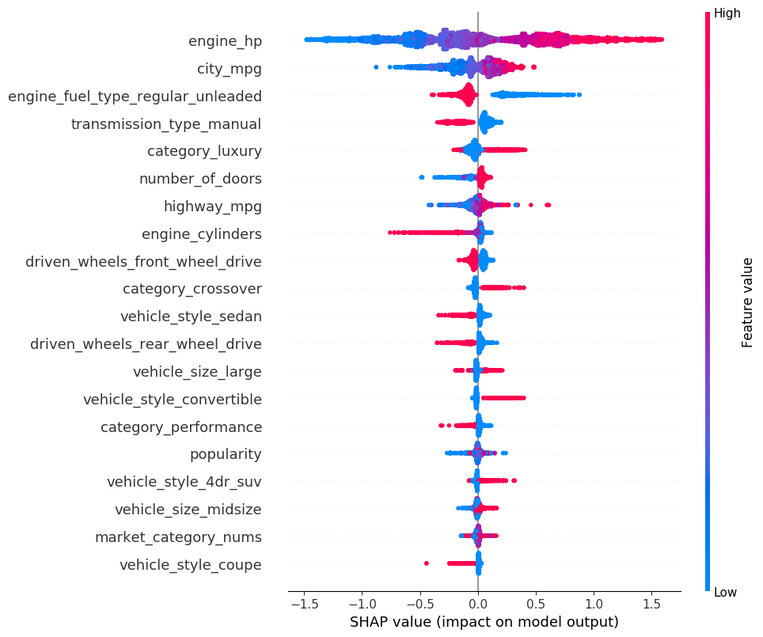
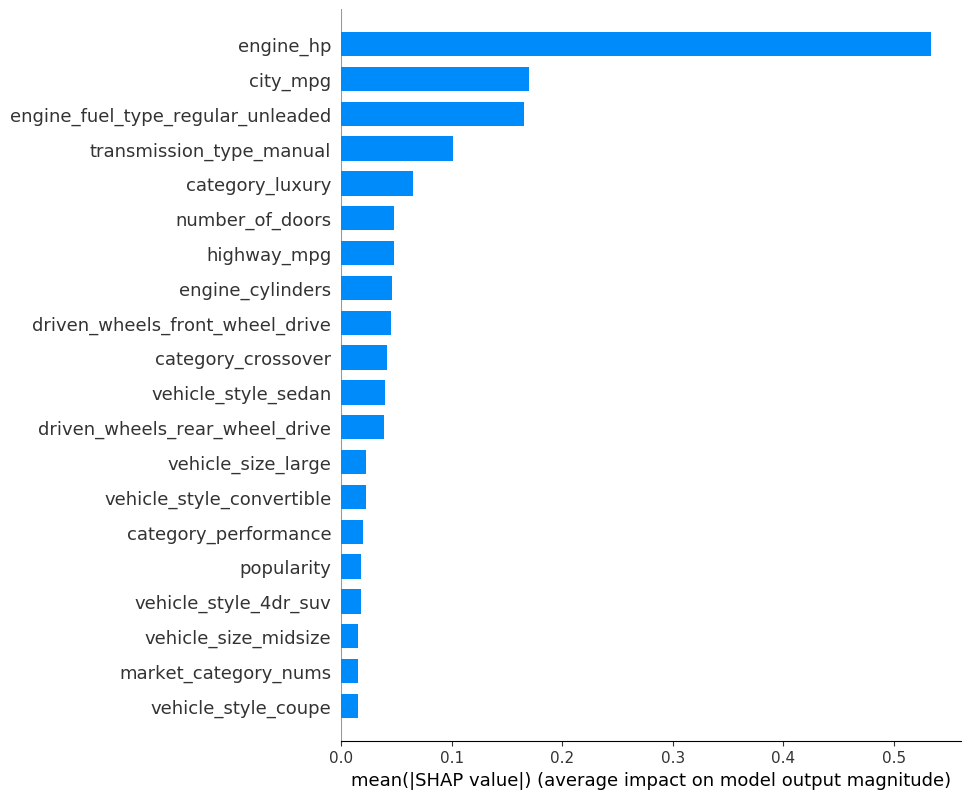

# Predict the Car Price using XGBoost in SQLFlow

This tutorial describes how to train an XGBoost model using the [Cars Dataset](https://www.kaggle.com/CooperUnion/cardataset), then how to predict the car price using SQLFlow. You can check out the [Language Guide](https://github.com/sql-machine-learning/sqlflow/blob/develop/doc/language_guide.md) if you are new to SQLFlow.

In this tutorial, you will learn how to:

- Train an XGBoost model to fit the cars dataset.
- Predict the car price using a well-trained model.
- Use the [SHAP EXPLAINER](https://github.com/slundberg/shap) toolkit to interpret the trained model then you can know
how these features affect the car price.

## The Car Price Dataset

We are using the [Cars Dataset](https://www.kaggle.com/CooperUnion/cardataset) as the demonstration dataset from [kaggle](https://www.kaggle.com/).

We use feature engineering to [preprocess](/doc/tutorial/apsara2019/carprice_xgboost/carprice_preprocessing.py) the raw data and creating new features.  The Car Price Dataset after preprocessing contains eighty-two numeric features and one label. Each feature identifies one characteristic of a car. And the label `msrp` indicates the car's price.

Here are some of the column descriptions of the dataset:

Column | Explain
-- | --
make_* | One-hot value for the "Make" field in the raw data.
engine_fuel_type_* | One-hot value for the "Engine Fuel Type" field in the raw data.
transmission_type_* | One-hot value for the "Transmission Type" field in the raw data.
driven_Wheels_* | One-hot value for the "Driven_Wheels" field in the raw data.
vehicle Size_* | One-hot value for the "Vehicle Size" field in the raw data.
vehicle style_* | One-hot value for the "Vehicle Style" field in the raw data.
market_category_nums | The number of categories for the "Market Category" field in the raw data
category_* |Identify this category in the "Market Category" field of the raw data(1 Yes, 0 No).
msrp | Float value for the manufacturer's suggested retail price of a Car

Finally, we separated the cars dataset into two tables `carprice.train` and `carprice.test` which would be used as training/testing data respectively.

**Note**: SQLFlow would automatically split the training dataset into a train/validation dataset while training progress.

We can have a quick peek of the data by running the following standard SQL statements.

```sql
%%sqlflow
describe carprice.train;
```

```sql
%%sqlflow
select *
from carprice.train
limit 1
```

## Train an XGBoost Model using SQLFlow

Let's train an XGBoost model on the dataset. We prefer to train the model for `300 rounds`,
and using `squarederror` loss function that the SQLFLow extended SQL can be like:

``` text
TO TRAIN xgboost.gbtree
WITH
    train.num_boost_round=300,
    objective="reg:squarederror"
```

`xgboost.gbtree` is the estimator name, `gbtree` is one of the [XGBoost booster](https://xgboost.readthedocs.io/en/latest/parameter.html#general-parameters).

To specify the training data, we use standard SQL statements to fetch the training data from table `carprice.train`:

``` text
SELECT * FROM carprice.train
```

We can explicitly specify which column to use in `COLUMN clause` and which column is used for the label by `LABEL` keyword:

``` text
COLUMN engine_hp, engine_cylinders, number_of_doors, highway_mpg, city_mpg, ...
LABEL msrp
```

To save the trained model, we can use `INTO clause` to specify a model name:

``` text
INTO sqlflow_models.my_xgb_regression_model
```

Finally, the following is the SQLFlow TO TRAIN statement of this regression task; you can run it in the cell:

```sql
%%sqlflow
SELECT *
FROM carprice.train
TO TRAIN xgboost.gbtree
WITH
    objective="reg:squarederror",
    train.num_boost_round = 300,
    eta = 0.1
COLUMN engine_hp, engine_cylinders, number_of_doors, highway_mpg, city_mpg, popularity, market_category_nums, category_factory_tuner, category_luxury, category_high_performance, category_performance, category_flex_fuel, category_hatchback, category_hybrid, category_diesel, category_exotic, category_crossover, make_audi, make_bmw, make_buick, make_cadillac, make_chevrolet, make_chrysler, make_dodge, make_fiat, make_ford, make_gmc, make_genesis, make_hummer, make_honda, make_hyundai, make_infiniti, make_kia, make_land_rover, make_lexus, make_lincoln, make_lotus, make_mazda, make_mercedes_benz, make_mitsubishi, make_nissan, make_oldsmobile, make_plymouth, make_pontiac, make_porsche, make_saab, make_scion, make_subaru, make_suzuki, make_toyota, make_volkswagen, make_volvo, engine_fuel_type_electric, engine_fuel_type_flex_fuel, engine_fuel_type_premium_unleaded_recommended, engine_fuel_type_premium_unleaded_required, engine_fuel_type_regular_unleaded, transmission_type_automatic, transmission_type_direct_drive, transmission_type_manual, transmission_type_unknown, driven_wheels_four_wheel_drive, driven_wheels_front_wheel_drive, driven_wheels_rear_wheel_drive, vehicle_size_large, vehicle_size_midsize, vehicle_style_2dr_suv, vehicle_style_4dr_hatchback, vehicle_style_4dr_suv, vehicle_style_cargo_minivan, vehicle_style_cargo_van, vehicle_style_convertible, vehicle_style_convertible_suv, vehicle_style_coupe, vehicle_style_crew_cab_pickup, vehicle_style_extended_cab_pickup, vehicle_style_passenger_minivan, vehicle_style_passenger_van, vehicle_style_regular_cab_pickup, vehicle_style_sedan, vehicle_style_wagon
LABEL msrp
INTO sqlflow_models.my_xgb_regression_model;
```

## Predict the Car Price

After training the regression model, let's predict the car price using the trained model.

First, we can specify the trained model by USING clause:

```text
USING sqlflow_models.my_xgb_regression_model
```

Then, we can specify the prediction result table by TO PREDICT clause:

```text
TO PREDICT carprice.predict.msrp
```

And using a standard SQL to fetch the prediction data.

```text
SELECT * FROM carprice.test
```

Finally, the following is the SQLFLow Prediction statement:

```sql
%%sqlflow
SELECT * FROM carprice.test
TO PREDICT carprice.predict.msrp
USING sqlflow_models.my_xgb_regression_model;
```

Let's have a glance at prediction results.

```sql
%%sqlflow
SELECT * FROM carprice.predict limit 5;
```

## Explain the Trained Model

We use the EXPLAIN SQL to explain the trained model. Behind the scene, SQLFlow will translate the EXPLAIN SQL to a Python program that reads the dataset, loads the trained model, then draws a figure using SHAP to explain the model.

We use the [TreeExplainer](https://github.com/slundberg/shap#tree-ensemble-example-with-treeexplainer-xgboostlightgbmcatboostscikit-learn-models) to draw a summary plot.

We can set the parameters of SHAP like:

``` sql
WITH
    summary.plot_type="dot",
    summary.alpha=1,
    summary.sort=True,
    summary.max_display=20
```

We can plot the SHAP values of every feature for every sample.

```sql
%%sqlflow
SELECT *
FROM carprice.train
TO EXPLAIN sqlflow_models.my_xgb_regression_model
WITH
    summary.plot_type="dot",
    summary.alpha=1,
    summary.sort=True,
    summary.max_display=20
USING TreeExplainer;
```



The plot above sorts features by the sum of SHAP value magnitudes over all samples, and use SHAP values to show the distribution of the impacts each feature has on the model output. The color represents the feature values(red high, blue low). For example, a low engine_hp lowers the predicted car price.

We can also take the mean absolute value of the SHAP values for each feature to get a standard bar plot:

```sql
%%sqlflow
SELECT *
FROM carprice.train
TO EXPLAIN sqlflow_models.my_xgb_regression_model
WITH
    summary.plot_type="bar",
    summary.alpha=1,
    summary.sort=True,
    summary.max_display=20
USING TreeExplainer;
```


