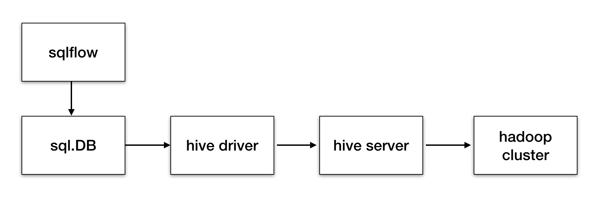

# Why needs a go hive driver?
Hadoop and hive have become one of the standard solutions for most Internet companies. Based on warehouse, sqlflow aims to provide more convenient AI solutions. Therefore, it is necessary to get through the path between sqlflow and data in hive. Technically, we need to obtain structured data in hive through remote rpc call launched by sqlflow's sql statements, and then we can put the  returned data into AI model to complete training or prediction tasks. In Go, the standard SQL, or SQL-like, database access interfaces is defined in [database/sql package](http://go-database-sql.org/) and a named driver indicates a specific database you want to use, while the remote RPC call provided by hive is implemented by thrift, so a go hive driver using hive thrift go client is needed.
# The architecture of gohive

# What APIs need to be implemented for a go hive driver？
* driver.go
      1. func ***Open***: return a driver.Conn.
      2. func ***init***: register the driver itself.
* connection.go
      1. func ***Exec***: execute a specific sql command.
      2. func ***Query***: execute a specific sql query and return a driver.Rows.
* rows.go
      1. func ***Columns***: return a []string contains all the column names of a query resultset.
      2. func ***Next***: return a []driver.Value contains the values of a single row.
* client.go (make thrift rpc call)

# HiveServer's thrift APIs
All the RPC APIs provided by hive server is defined in file:
```
https://github.com/apache/hive/blob/master/service-rpc/if/TCLIService.thrift 
```

And the service definition is as below:

```
service TCLIService {
  TOpenSessionResp OpenSession(1:TOpenSessionReq req);
  TCloseSessionResp CloseSession(1:TCloseSessionReq req);
  TGetInfoResp GetInfo(1:TGetInfoReq req);
  TExecuteStatementResp ExecuteStatement(1:TExecuteStatementReq req);
  TGetTypeInfoResp GetTypeInfo(1:TGetTypeInfoReq req);
  TGetCatalogsResp GetCatalogs(1:TGetCatalogsReq req);
  TGetSchemasResp GetSchemas(1:TGetSchemasReq req);
  TGetTablesResp GetTables(1:TGetTablesReq req);
  TGetTableTypesResp GetTableTypes(1:TGetTableTypesReq req);
  TGetColumnsResp GetColumns(1:TGetColumnsReq req);
  TGetFunctionsResp GetFunctions(1:TGetFunctionsReq req);
  TGetPrimaryKeysResp GetPrimaryKeys(1:TGetPrimaryKeysReq req);
  TGetCrossReferenceResp GetCrossReference(1:TGetCrossReferenceReq req);
  TGetOperationStatusResp GetOperationStatus(1:TGetOperationStatusReq req);
  TCancelOperationResp CancelOperation(1:TCancelOperationReq req);
  TCloseOperationResp CloseOperation(1:TCloseOperationReq req);
  TGetResultSetMetadataResp GetResultSetMetadata(1:TGetResultSetMetadataReq req);
  TFetchResultsResp FetchResults(1:TFetchResultsReq req);
  TGetDelegationTokenResp GetDelegationToken(1:TGetDelegationTokenReq req);
  TCancelDelegationTokenResp CancelDelegationToken(1:TCancelDelegationTokenReq req);
  TRenewDelegationTokenResp RenewDelegationToken(1:TRenewDelegationTokenReq req);
  TGetQueryIdResp GetQueryId(1:TGetQueryIdReq req);
  TSetClientInfoResp SetClientInfo(1:TSetClientInfoReq req);
}
```
# TODO list
+ build a hive docker image that contains all the components hive needs to  depend on.
+ generate hive go thrift client.
+ implement go driver APIs using the thrift client above.
+ execute sql query through sqlflow to test the go hive driver.